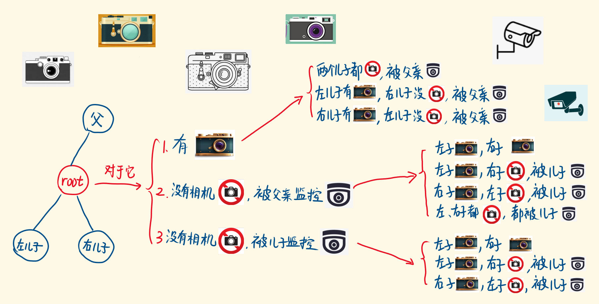

- [968. 监控二叉树](#968-监控二叉树)
  - [官方题解](#官方题解)
    - [方法一：递归](#方法一递归)
  - [其它题解](#其它题解)
    - [「手画图解」从递归优化到树形DP | 监控二叉树](#手画图解从递归优化到树形dp--监控二叉树)

------------------------------

# 968. 监控二叉树

给定一个二叉树，我们在树的节点上安装摄像头。

节点上的每个摄影头都可以监视其父对象、自身及其直接子对象。

计算监控树的所有节点所需的最小摄像头数量。

示例 1：


```
输入：[0,0,null,0,0]
输出：1
解释：如图所示，一台摄像头足以监控所有节点。
```

示例 2：


```
输入：[0,0,null,0,null,0,null,null,0]
输出：2
解释：需要至少两个摄像头来监视树的所有节点。 上图显示了摄像头放置的有效位置之一。
```

提示：

1. 给定树的节点数的范围是 [1, 1000]。
2. 每个节点的值都是 0。

- 来源：力扣（LeetCode）
- 链接：https://leetcode-cn.com/problems/binary-tree-cameras
- 著作权归领扣网络所有。商业转载请联系官方授权，非商业转载请注明出处。


## 官方题解

> 链接：https://leetcode-cn.com/problems/binary-tree-cameras/solution/jian-kong-er-cha-shu-by-leetcode-solution/

### 方法一：递归

本题以二叉树为背景，不难想到用递归的方式求解。本题的难度在于如何从左、右子树的状态，推导出父节点的状态。

为了表述方便，我们约定：如果某棵树的所有节点都被监控，则称该树被「覆盖」。

假设当前节点为 $\textit{root}$，其左右孩子为 $\textit{left}, \textit{right}$。如果要覆盖以 $\textit{root}$ 为根的树，有两种情况：

- 若在 $\textit{root}$ 处安放摄像头，则孩子 $\textit{left}, \textit{right}$ 一定也会被监控到。此时，只需要保证 $\textit{left}$ 的两棵子树被覆盖，同时保证 $\textit{right}$ 的两棵子树也被覆盖即可。
- 否则， 如果 $\textit{root}$ 处不安放摄像头，则除了覆盖 $\textit{root}$ 的两棵子树之外，孩子 $\textit{left}, \textit{right}$ 之一必须要安装摄像头，从而保证 $\textit{root}$ 会被监控到。

根据上面的讨论，能够分析出，对于每个节点 $\textit{root}$ ，需要维护三种类型的状态(**这三种状态看的是一头雾水啊，不好理解，可以看其它题解**)：

- 状态 $a$：$\textit{root}$ 必须放置摄像头的情况下，覆盖整棵树需要的摄像头数目。
- 状态 $b$：覆盖整棵树需要的摄像头数目，无论 $\textit{root}$ 是否放置摄像头。
- 状态 $c$：覆盖两棵子树需要的摄像头数目，无论节点 $\textit{root}$ 本身是否被监控到。

根据它们的定义，一定有 $a \geq b \geq c$。

对于节点 $\textit{root}$ 而言，设其左右孩子 $\textit{left}, \textit{right}$ 对应的状态变量分别为 $(l_a,l_b,l_c)$ 以及 $(r_a,r_b,r_c)$。根据一开始的讨论，我们已经得到了求解 a,b 的过程：

- $a = l_c + r_c + 1$
- $b = \min(a, \min(l_a + r_b, r_a + l_b))$

对于 $c$ 而言，要保证两棵子树被完全覆盖，要么 $\textit{root}$ 处放置一个摄像头，需要的摄像头数目为 $a$；要么 $\textit{root}$ 处不放置摄像头，此时两棵子树分别保证自己被覆盖，需要的摄像头数目为 $l_b + r_b$。

需要额外注意的是，对于 $\textit{root}$ 而言，如果其某个孩子为空，则不能通过在该孩子处放置摄像头的方式，监控到当前节点。因此，该孩子对应的变量 $a$ 应当返回一个大整数，用于标识不可能的情形。

最终，根节点的状态变量 $b$ 即为要求出的答案。

```go
const inf = math.MaxInt32 / 2 // 或 math.MaxInt64 / 2

func minCameraCover(root *TreeNode) int {
    var dfs func(*TreeNode) (a, b, c int)
    dfs = func(node *TreeNode) (a, b, c int) {
        if node == nil {
            return inf, 0, 0
        }
        la, lb, lc := dfs(node.Left)
        ra, rb, rc := dfs(node.Right)
        a = lc + rc + 1
        b = min(a, min(la+rb, ra+lb))
        c = min(a, lb+rb)
        return
    }
    _, ans, _ := dfs(root)
    return ans
}

func min(a, b int) int {
    if a < b {
        return a
    }
    return b
}
```

- 时间复杂度：$O(N)$，其中 N 为树中节点的数量。对于每个节点，我们在常数时间内计算出 a,b,c 三个状态变量。
- 空间复杂度：$O(N)$。每次递归调用时，我们需要开辟常数大小的空间存储状态变量的取值，而递归栈的深度等于树的深度，即 $O(N)$。


## 其它题解

### 「手画图解」从递归优化到树形DP | 监控二叉树

> 链接：https://leetcode-cn.com/problems/binary-tree-cameras/solution/shou-hua-tu-jie-cong-di-gui-you-hua-dao-dong-tai-g/

对于一个节点，它有什么状态，仅仅是放与不放相机吗？还有：是否被监控到。

两者可以重叠吗？可以的，被监控到的节点，也可以放相机。

有三个变量去描述一个节点的状态：节点本身（代表不同的子树）、是否放了相机、是否被监控到。

我们定义递归函数 minCam，计算：以当前 root 为根节点的子树，需要放置的最少相机数。

求整个树的 minCam，拆分为求子树的 minCam，当前子树的minCam = 左子树的minCam + 右子树的minCam + 1(不一定+1)，位于底部的 base case 易得，自上而下地调用，答案自下而上地返回。

递归函数接收的参数，对应上述三个变量：

1. 当前遍历的 root 节点。
2. placeCam：root 处是否放相机。
3. watched：root 是否被父亲或自己监控。

因为递归是父亲调用儿子，对于当前节点，它只知道父亲和自己有没有监控自己，不知道儿子有没有监控自己，所以，watched 只代表是否被父亲或自己监控。

对于一个子树的根节点，它的状态无非下面三种，我们对应求出：子树不同状态下的 minCam。



1. 当前节点 root 放了相机（当前子树的相机数，保底为1）
    1. 左右儿子都没有放相机，都被父亲监控: `minCam(root.left, false, true) + minCam(root.right, false, true)`
    2. 左儿子放了相机，被监控，右儿子没有相机，被父亲监控: `minCam(root.left, true, true) + minCam(root.right, false, true)`
    3. 左儿子没有相机，被父亲监控，右儿子放了相机，被监控: `minCam(root.left, false, true) + minCam(root.right, true, true)`
    4. **左右儿子都放相机的情况就不需要考虑了吗？**
    5. **左右儿子还可以被自己的儿子监控啊？** 这种情况在 1 上考虑了。
2. 当前节点 root 没有相机，但被父亲监控了
    1. 两个儿子都放了相机，被监控
    2. 左儿子放了相机，被监控，右儿子没有相机，没有被父亲和自己监控，但被自己儿子监控
    3. 右儿子放了相机，被监控，左儿子没有相机，没有被父亲和自己监控，但被自己儿子监控
    4. 两个儿子都没有相机，没有被父亲和自己监控，但被自己儿子监控
3. 当前节点 root 没有相机，也没有被父亲监控，是被儿子监控
    1. 两个儿子都放了相机，被监控
    2. 左儿子有相机，被监控，右儿子没有相机，没被父亲和自己监控，被自己儿子监控
    3. 左儿子没有相机，没被父亲和自己监控，被自己儿子监控。右儿子有相机，被监控

**递归的入口**

整个树的根节点，它被监控，分两种情况：

1. 根节点有相机。
2. 根节点没有相机，且根节点没有父亲，没有被父亲监控，但被儿子监控。

对这两种情况求 minCam，返回结果较小者。

```js
const minCameraCover = (root) => {
  const minCam = (root, placeCam, watched) => { 
    // 省略
  };
  return Math.min(minCam(root, true, true), minCam(root, false, false));
};
```

**递归的结束条件**

即 base case。当遍历到 null 节点时：

```js
if (root == null) {  // 遍历到null节点
  if (placeCam) {    // 父节点问自己，有相机的minCam，但null节点不可能有相机
    return Infinity; // 返回无穷大，让这个返回值被忽略掉（因为Math.min）
  } else {           // null没有相机，也没有子节点，下面也没有相机，返回0
    return 0;
  }
}
```

完整代码，但是会超时：

```js
const minCameraCover = (root) => {
  // 以root为根节点的子树，放置的最少相机数
  const minCam = (root, placeCam, watched) => {
    if (root == null) {  // 遍历到null节点
      if (placeCam) {    // 父节点问自己有相机的情况，但臣妾办不到
        return Infinity; // 返回一个无穷大，让这个返回值失效
      } else {
        return 0;
      }
    }
    if (placeCam) {        // root放置相机
      return 1 + Math.min( // root放了相机，相机数有 1 保底
        minCam(root.left, false, true) + minCam(root.right, false, true), 
        minCam(root.left, true, true) + minCam(root.right, false, true), 
        minCam(root.left, false, true) + minCam(root.right, true, true) 
      );  
    } else {
      if (watched) { // root没放相机，但被父亲监控了
        return Math.min(
          minCam(root.left, true, true) + minCam(root.right, true, true),
          minCam(root.left, true, true) + minCam(root.right, false, false), 
          minCam(root.left, false, false) + minCam(root.right, true, true), 
          minCam(root.left, false, false) + minCam(root.right, false, false) 
        );
      } else {      // root没有相机，也没被父亲监控，被儿子监控了
        return Math.min(
          minCam(root.left, true, true) + minCam(root.right, true, true), 
          minCam(root.left, true, true) + minCam(root.right, false, false), 
          minCam(root.left, false, false) + minCam(root.right, true, true) 
        );
      }
    }
  };
  return Math.min(
    minCam(root, true, true),  // 根节点有相机
    minCam(root, false, false) // 根节点没有相机，因为没有父亲，没有被父亲监控，是被儿子监控
  );
};
```

**怎么优化？哪里做了重复的计算？**

可以看到，我们反复地在调用左右子树，传的参数就有很多重复。

我们看到，对于一个子树，它有三种返回值，即三种状态下的最优解。我们这样，对于每一个子树，即每一次递归调用，都计算三种状态下的最优解 minCam：

1. withCam ：当前子树 root 有相机，情况下的minCam
2. noCamWatchByDad：当前子树 root 没有相机，被父亲监控，情况下的minCam
3. noCamWatchBySon：当前子树 root 没有相机，被儿子监控，情况下的minCam

相当于 `dp[root][0],dp[root][1],dp[root][2]`，放入一个对象，返回出来，返回给父调用。

```js
return { withCam, noCamWatchByDad, noCamWatchBySon };
```

当前以 root 为根的子树，递归调用左右子树，拿到子树的三种最优解，递推算出当前树的三种最优解：withCam、noCamWatchByDad、noCamWatchBySon。

```js
const left = minCam(root.left);
const right = minCam(root.right);
```

这样，一次递归调用，就只执行两次子调用。

**优化后代码**

```js
const minCameraCover = (root) => {
  const minCam = (root) => {
    if (root == null) {   // base case
      return {
        withCam: Infinity,
        noCamWatchByDad: 0,
        noCamWatchBySon: 0
      };
    }
    const left = minCam(root.left);   // 以左儿子为根的左子树的minCam
    const right = minCam(root.right); // 以右儿子为根的右子树的minCam
    // 下面相当于状态转移方程
    const withCam = 1 + Math.min(     
      left.noCamWatchByDad + right.noCamWatchByDad,
      left.withCam + right.noCamWatchByDad,
      left.noCamWatchByDad + right.withCam
    );

    const noCamWatchByDad = Math.min(
      left.withCam + right.withCam,
      left.withCam + right.noCamWatchBySon,
      left.noCamWatchBySon + right.withCam,
      left.noCamWatchBySon + right.noCamWatchBySon
    );

    const noCamWatchBySon = Math.min(
      left.withCam + right.withCam,
      left.withCam + right.noCamWatchBySon,
      left.noCamWatchBySon + right.withCam
    );

    return { withCam, noCamWatchByDad, noCamWatchBySon };
  };

  const res = minCam(root); // 相当于dp[root]
  return Math.min(res.withCam, res.noCamWatchBySon); // 相当于 dp[root][0]、dp[root][2]
};
```
