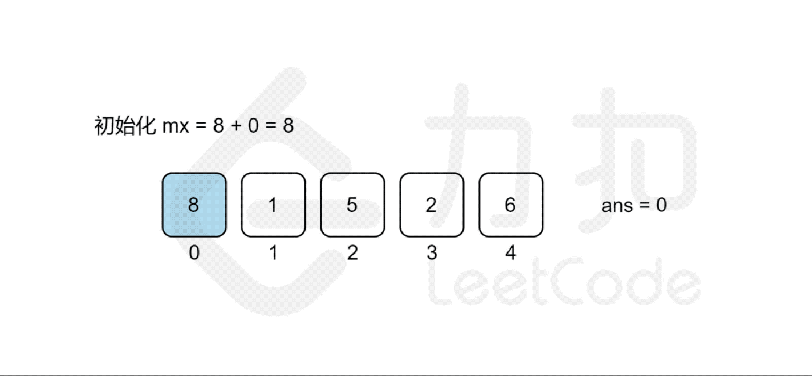

- [1014. 最佳观光组合](#1014-最佳观光组合)
  - [题目](#题目)
  - [题解](#题解)
    - [方法一：枚举](#方法一枚举)


------------------------------

# 1014. 最佳观光组合

## 题目

给定正整数数组 A，`A[i]` 表示第 i 个观光景点的评分，并且两个景点 i 和 j 之间的距离为 `j - i`。

一对景点（i < j）组成的观光组合的得分为（`A[i] + A[j] + i - j`）：景点的评分之和减去它们两者之间的距离。

返回一对观光景点能取得的最高分。

示例：

```
输入：[8,1,5,2,6]
输出：11
解释：i = 0, j = 2, A[i] + A[j] + i - j = 8 + 5 + 0 - 2 = 11
```

提示：

- `2 <= A.length <= 50000`
- `1 <= A[i] <= 1000`

- 来源：力扣（LeetCode）
- 链接：https://leetcode-cn.com/problems/best-sightseeing-pair
- 著作权归领扣网络所有。商业转载请联系官方授权，非商业转载请注明出处。

## 题解

### 方法一：枚举

链接：https://leetcode-cn.com/problems/best-sightseeing-pair/solution/zui-jia-guan-guang-zu-he-by-leetcode-solution/

**思路和算法**

我们考虑从前往后枚举 j 来统计答案，对于每个观光景点 j 而言，我们需要遍历 $[0,j-1]$ 的观光景点 i 来计算组成观光组合 $(i,j)$ 得分的最大值 $\textit{cnt}_j$​ 来作为第 j 个观光景点的值，那么最后的答案无疑就是所有观光景点值的最大值，即 $\max_{j=0..n-1}\{cnt_j\}$。但是枚举 j 需要 $O(n)$ 的时间复杂度，遍历 $[0,j−1]$ 的观光景点 i 也需要 $O(n)$ 的时间复杂度，因此该方法总复杂度为 $O(n^2)$，不能通过所有测试用例，我们需要进一步优化时间复杂度。

我们回过头来看得分公式，我们可以将其拆分成 $A[i]+i$ 和 $A[j]−j$ 两部分，这样对于统计景点 j 答案的时候，**由于 $A[j]−j$ 是固定不变的**，因此最大化 $A[i]+i+A[j]−j$ 的值其实就等价于求 $[0,j−1]$ 中 $A[i]+i$ 的最大值 $mx$，景点 j 的答案即为 $mx+A[j]-j$ 。**而 mx 的值我们只要从前往后枚举 j 的时候同时维护即可**，这样每次枚举景点 j 的时候，寻找使得得分最大的 i 就能从 $O(n)$ 降至 $O(1)$ 的时间复杂度，总时间复杂度就能从 $O(n^2)$ 降至 $O(n)$。



```go
func maxScoreSightseeingPair(A []int) int {
    ans, mx := 0, A[0] + 0
    for j := 1; j < len(A); j++ {
        // 这里用的 mx 只到 j 之前的数的最大值，不包括 j
        ans = max(ans, mx + A[j] - j)
        // 边遍历边维护
        mx = max(mx, A[j] + j)
    }
    return ans
}

func max(x, y int) int {
    if x > y {
        return x
    }
    return y
}
```

复杂度分析

- 时间复杂度：$O(n)$，其中 n 为数组 A 的大小。我们只需要遍历一遍数组即可。
- 空间复杂度：$O(1)$。我们只需要常数空间来存放若干变量。


--------------------

刚开始想的是遍历 `A[i]`，然后再从 `A[i+1]` 开始找 `A[j]`。这样复杂度是 $O(n^2)$。

也想过从公式 `A[i] + A[j] + i - j` 来入手，如果能找到可以快速排除其余组合的方式就好了。不过没有头绪，主要是这四个都不确定啊。

上面的解答分析的角度和我想的不一样：
- 以遍历 `A[j]` 为主。我想的是最外层是遍历 `A[i]`。
- 将公式转换成 `A[i] + i + A[j] - j`。这样最外层每遍历一次，`A[j]-j` 是固定的，只要求 `A[i]+i` 的最大值就可以了。（如果最外层遍历的是 `A[i]`，那么这个公式中 `A[i]+i` 就是固定的，可以求 `A[j]-j` 的最大值，求这个最大值还是得每次把剩下的元素都遍历一遍）