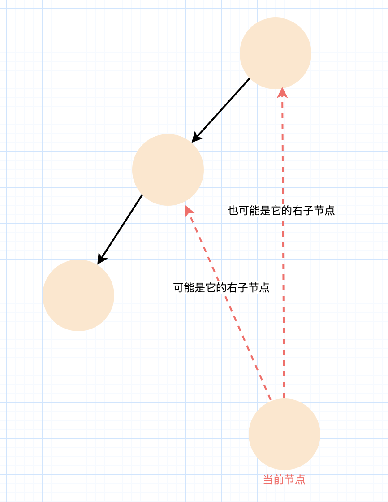
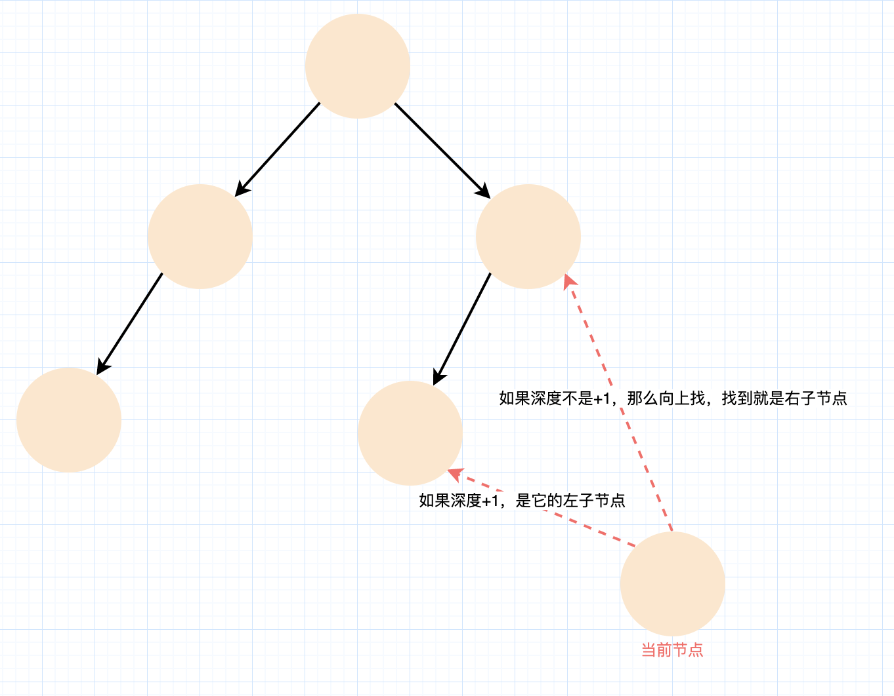

- [1028. 从先序遍历还原二叉树](#1028-从先序遍历还原二叉树)
  - [题目](#题目)
  - [题解](#题解)
    - [方法一：迭代](#方法一迭代)
    - [我的分析](#我的分析)

------------------------------

# 1028. 从先序遍历还原二叉树

## 题目

我们从二叉树的根节点 root 开始进行深度优先搜索。

在遍历中的每个节点处，我们输出 D 条短划线（其中 D 是该节点的深度），然后输出该节点的值。（如果节点的深度为 D，则其直接子节点的深度为 D + 1。根节点的深度为 0）。

如果节点只有一个子节点，那么保证该子节点为左子节点。

给出遍历输出 S，还原树并返回其根节点 root。

示例 1：


```
输入："1-2--3--4-5--6--7"
输出：[1,2,5,3,4,6,7]
```

示例 2：


```
输入："1-2--3---4-5--6---7"
输出：[1,2,5,3,null,6,null,4,null,7]
```

示例 3：


```
输入："1-401--349---90--88"
输出：[1,401,null,349,88,90]
```

提示：

- 原始树中的节点数介于 1 和 1000 之间。
- 每个节点的值介于 1 和 $10 ^ 9$ 之间。

------------------------------

- 来源：力扣（LeetCode）
- 链接：https://leetcode-cn.com/problems/recover-a-tree-from-preorder-traversal
- 著作权归领扣网络所有。商业转载请联系官方授权，非商业转载请注明出处。


## 题解

链接：https://leetcode-cn.com/problems/recover-a-tree-from-preorder-traversal/solution/cong-xian-xu-bian-li-huan-yuan-er-cha-shu-by-leetc/

前言: 相较于传统的递归 + 回溯的实现方法而言，本题使用迭代方法（模拟递归）更加简洁方便。

### 方法一：迭代

我们每次从字符串 s 中取出一个节点的值以及它的深度信息。具体地：

- 我们首先读取若干个字符 `-`，直到遇到非 `-` 字符位置。通过 `-` 的个数，我们就可以知道当前节点的深度信息；
- 我们再读取若干个数字，直到遇到非数字或者字符串的结尾。通过这些数字，我们就可以知道当前节点的值。

得到这些信息之后，我们就需要**考虑将当前的节点放在何处**。记当前节点为 T，上一个节点为 S，那么实际上只有两种情况：

- T 是 S 的左子节点；
- T 是根节点到 S 这一条路径上（不包括 S）某一个节点的右子节点。
    - 为什么不包括 S？因为题目中规定了如果节点只有一个子节点，那么保证该子节点为左子节点。在 T 出现之前，S 仍然还是一个叶节点，没有左子节点，因此 T 如果是 S 的子节点，一定是优先变成 S 的左子节点。

这是因为先序遍历本身的性质。在先序遍历中，我们是通过「**根 — 左 — 右**」的顺序访问每一个节点的。想一想先序遍历的递归 + 回溯方法，对于在先序遍历中任意的两个相邻的节点 S 和 T，要么 T 就是 S 的左子节点（对应上面的第一种情况），要么在遍历到 S 之后发现 S 是个叶节点，于是回溯到之前的某个节点，并开始递归地遍历其右子节点（对应上面的第二种情况）。这样以来，我们按照顺序维护从根节点到当前节点的路径上的所有节点，就可以方便地处理这两种情况。仔细想一想，这实际上就是使用递归 + 回溯的方法遍历一棵树时，栈中的所有节点，也就是可以回溯到的节点。因此我们只需要使用一个栈来模拟递归 + 回溯即可。

回到上面的分析，当我们得到当前节点的值以及深度信息之后，我们可以发现：如果 T 是 S 的左子节点，那么 T 的深度恰好比 S 的深度大 1；在其它的情况下，T 是栈中某个节点（不包括 S）的右子节点，那么我们将栈顶的节点不断地出栈，直到 T 的深度恰好比栈顶节点的深度大 1，此时我们就找到了 T 的双亲节点。

扩展与思考

通过上面的分析，我们只需要借助一个栈，通过迭代的方法就可以还原出这棵二叉树。由于题目给出的 S 一定是某棵二叉树的先序遍历结果，因此我们在代码中不需要处理任何异常异常情况。

读者可以进行如下的思考：如果给定的 S 只保证由数字和 `-` 组成，那么我们如何修改代码，使其判断是否能够还原出一棵二叉树呢？

```go
func recoverFromPreorder(S string) *TreeNode {
    path, pos := []*TreeNode{}, 0
    for pos < len(S) {
        level := 0
        for S[pos] == '-' {
            level++
            pos++
        }
        value := 0
        for ; pos < len(S) && S[pos] >= '0' && S[pos] <= '9'; pos++ {
            value = value * 10 + int(S[pos] - '0')
        }
        node := &TreeNode{Val: value}
        if level == len(path) {
            if len(path) > 0 { path[len(path)-1].Left = node }
        } else {
            path = path[:level]
            path[len(path)-1].Right = node
        }
        path = append(path, node)
    }
    return path[0]
}
```

```java
class Solution {
    public TreeNode recoverFromPreorder(String S) {
        Deque<TreeNode> path = new LinkedList<TreeNode>();
        int pos = 0;
        while (pos < S.length()) {
            int level = 0;
            while (S.charAt(pos) == '-') {
                ++level;
                ++pos;
            }
            int value = 0;
            while (pos < S.length() && Character.isDigit(S.charAt(pos))) {
                value = value * 10 + (S.charAt(pos) - '0');
                ++pos;
            }
            TreeNode node = new TreeNode(value);
            if (level == path.size()) {
                if (!path.isEmpty()) {
                    path.peek().left = node;
                }
            }
            else {
                while (level != path.size()) {
                    path.pop();
                }
                path.peek().right = node;
            }
            path.push(node);
        }
        while (path.size() > 1) {
            path.pop();
        }
        return path.peek();
    }
}
```


复杂度分析

- 时间复杂度：$O(|s|)$，其中 $|s|$ 是字符串 s 的长度。我们的算法不断地从 S 中取出一个节点的信息，直到取完为止。在这个过程中，我们实际上是对 S 进行了一次遍历。
- 空间复杂度：$O(h)$，其中 h 是还原出的二叉树的高度。除了作为答案返回的二叉树使用的空间以外，我们使用了一个栈帮助我们进行迭代。由于栈中存放了从根节点到当前节点这一路径上的所有节点，因此最多只会同时有 h 个节点。


### 我的分析





理想情况下，每次拿到一个数字都是上一个节点的左子节点。如果不是的话就得向上找了。如果跳过了一个节点，发现 depth 不匹配，那么说明这个节点是没有右子节点的，不然一定在当前节点之前。

depth 的匹配有个技巧是：depth 和在栈中的位置有关。比如 root 节点的 depth 是 0，它在栈中时，栈的长度是 1. 所以如果当前节点的 depth 是 n，那么它的父节点的 depth 是 n-1，所以找到栈中长度是 n 的那个节点就是了。