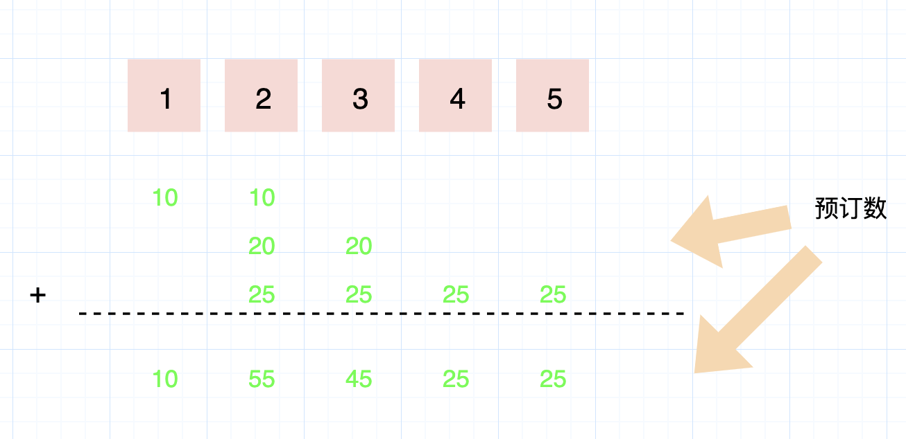
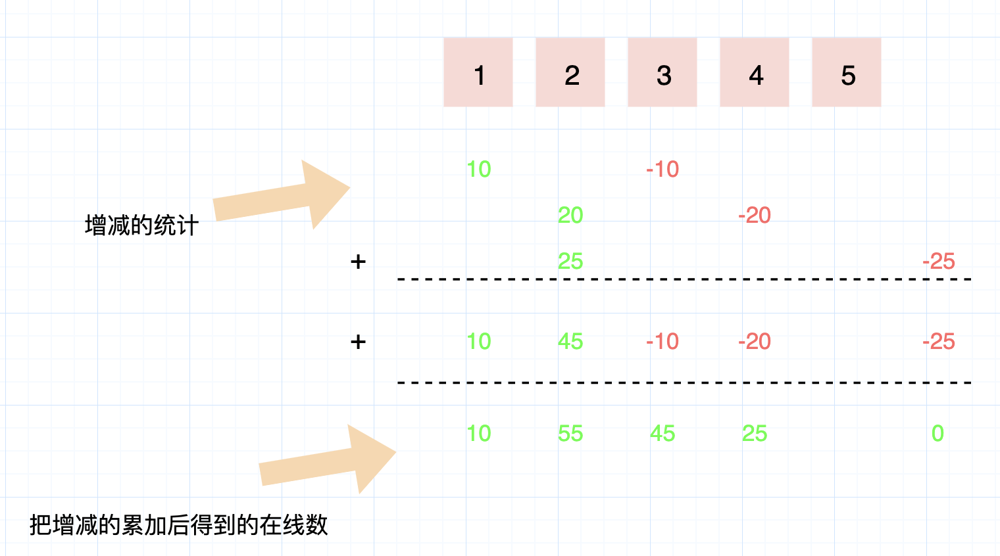

- [航班预订统计](#航班预订统计)
  - [题目](#题目)
  - [题解](#题解)


------------------------------

# 航班预订统计

## 题目

这里有 n 个航班，它们分别从 1 到 n 进行编号。

我们这儿有一份航班预订表，表中第 i 条预订记录 `bookings[i] = [i, j, k]` 意味着我们在从 i 到 j 的每个航班上预订了 k 个座位。

请你返回一个长度为 n 的数组 answer，按航班编号顺序返回每个航班上预订的座位数。

 
示例：

```
输入：bookings = [[1,2,10],[2,3,20],[2,5,25]], n = 5
输出：[10,55,45,25,25]
```

提示：

```
1 <= bookings.length <= 20000
1 <= bookings[i][0] <= bookings[i][1] <= n <= 20000
1 <= bookings[i][2] <= 10000
```

- 来源：力扣（LeetCode）
- 链接：https://leetcode-cn.com/problems/corporate-flight-bookings
- 著作权归领扣网络所有。商业转载请联系官方授权，非商业转载请注明出处。

## 题解



每个位置在线的都标记出来，下线的标记成负数，累加后得到的就是那个位置在线的。



这个是只记录预订的开始和结束，开始为正数，结束时为负数。然后从开始到最后累加后得到的就是每个位置在线的。

和这个类似的题目还有：在线人数的峰值统计：每个用户有登录和登出时间，算哪个时间段的在线用户人数最多。和这个是一样的解法。

```java
public class CorporateFlightBookings {
    public int[] corpFlightBookings(int[][] bookings, int n) {
        int[] counters = new int[n];
        for (int[] booking : bookings) {
            counters[booking[0] - 1] += booking[2];
            if (booking[1] < n) {
                counters[booking[1]] -= booking[2];
            }
        }
        for (int i = 1; i < n; ++i) {
            counters[i] += counters[i - 1];
        }
        return counters;
    }
}
```