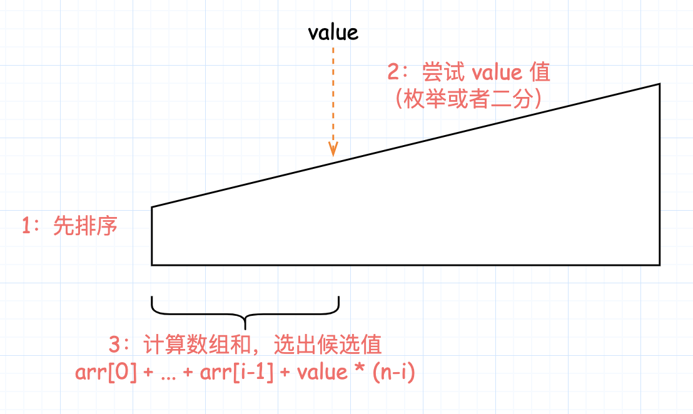

- [1300. 转变数组后最接近目标值的数组和](#1300-转变数组后最接近目标值的数组和)
  - [题目](#题目)
  - [题解](#题解)
    - [枚举 + 二分查找](#枚举--二分查找)
    - [双重二分查找](#双重二分查找)


------------------------------

# 1300. 转变数组后最接近目标值的数组和

## 题目

给你一个整数数组 arr 和一个目标值 target ，请你返回一个整数 value ，使得将数组中所有大于 value 的值变成 value 后，数组的和最接近  target （最接近表示两者之差的绝对值最小）。

如果有多种使得和最接近 target 的方案，请你返回这些整数中的最小值。

请注意，答案不一定是 arr 中的数字。


示例 1：

```
输入：arr = [4,9,3], target = 10
输出：3
解释：当选择 value 为 3 时，数组会变成 [3, 3, 3]，和为 9 ，这是最接近 target 的方案。
```

示例 2：

```
输入：arr = [2,3,5], target = 10
输出：5
```

示例 3：

```
输入：arr = [60864,25176,27249,21296,20204], target = 56803
输出：11361
```

 
提示：

- $1 <= arr.length <= 10^4$
- $1 <= arr[i], target <= 10^5$

-------

- 来源：力扣（LeetCode）
- 链接：https://leetcode-cn.com/problems/sum-of-mutated-array-closest-to-target
- 著作权归领扣网络所有。商业转载请联系官方授权，非商业转载请注明出处。


## 题解

### 枚举 + 二分查找

由于数组 arr 中每个元素值的范围是 $[1,10^5]$，在可以直接枚举的范围内，因此我们可以对所有可能作为 value 的值进行枚举。

那么 value 值的上下界是多少呢？我们需要进行一些分析：

- value 的下界为 0。这是因为当 value = 0 时，数组的和为 0。由于 target 是正整数，因此当 value 继续减小时，数组的和也会随之减小，且变为负数（这个和等于 value * n，其中 n 是数组 arr 的长度），并不会比 value = 0 时更接近 target。
- value 的上界为数组 arr 中的最大值。这是因为当 value >= arr 时，数组中所有的元素都不变，因为它们均不大于 value。由于我们需要找到最接近 target 的最小 value 值，因此我们只需将数组 arr 中的最大值作为上界即可。(就是说：只要是选了比最大值还大的，那么就不会改变数组，因为只能改大于 value 的元素。)

当我们确定了 value 值的上下界之后，就可以进行枚举了。当枚举到 `value = x` 时，我们需要将数组 arr 中**所有小于等于 x 的值保持不变**，所有大于 x 的值变为 x。要实现这个操作，我们可以将数组 arr 先进行排序，随后进行二分查找，找出数组 arr 中最小的比 x 大的元素 `arr[i]`。此时数组的和变为

$$
arr[0] + ... + arr[i - 1] + x * (n - i)
$$

由于将数组 arr 中的等于 x 的值变为 x 并没有改变原来的值，因此上述操作可以改为：当枚举到 value = x 时，我们需要将数组 arr 中**所有小于 x 的值保持不变**，所有大于等于 x 的值变为 x。要实现这个操作，我们可以将数组 arr 先进行排序，随后进行二分查找，找出数组 arr 中最小的大于等于 x 的元素 `arr[i]`。此时数组的和变为

$$
arr[0] + ... + arr[i - 1] + x * (n - i)
$$

使用该操作是因为很多编程语言自带的二分查找只能返回目标值第一次出现的位置。在此鼓励读者自己实现**返回目标值最后一次出现的位置的二分查找**。

为了加速求和操作，我们可以预处理出数组 arr 的前缀和，这样数组求和的时间复杂度即能降为 $O(1)$。我们将和与 target 进行比较，同时更新答案即可。

```go
func findBestValue(arr []int, target int) int {
    sort.Ints(arr)
    n := len(arr)
    // prefix[0] = 0 // 为什么要有这个呢？
    // prefix[1] = arr[0]
    // prefix[2] = arr[0] + arr[1]
    // prefix[3] = arr[0] + arr[1] + arr[2]
    // ...
    // prefix[n] = arr[0] + arr[1] + arr[2] + ... + arr[n-1]
    prefix := make([]int, n + 1)
    for i := 1; i <= n; i++ {
        prefix[i] = prefix[i-1] + arr[i-1]
    }
    r := arr[n-1] // 最大的
    ans, diff := 0, target
    for i := 1; i <= r; i++ { // i 是尝试的 value 值
        index := sort.SearchInts(arr, i) // 返回 i 应该插入的地方
        if index < 0 { // 如果是 -1，那 index 就设置成 0，这就是为什么 prefix 要有 [0]。
            index = -index - 1
        }
        cur := prefix[index] + (n - index) * i
        if abs(cur - target) < diff {
            ans = i
            diff = abs(cur - target)
        }
    }
    return ans
}

func abs(x int) int {
    if x < 0 {
        return -1 * x
    }
    return x
}
```

**复杂度分析**

- 时间复杂度：$O((N + C)\log N)$，其中 N 是数组 arr 的长度，C 是一个常数，为数组 arr 中的最大值，不会超过 $10^5$。排序需要的时间复杂度为 $O(N \log N)$，二分查找的单次时间复杂度为 $O(\log N)$，需要进行 C 次。
- 空间复杂度：$O(N)$。我们需要 $O(N)$ 的空间用来存储数组 arr 的前缀和，排序需要 $O(\log N)$ 的栈空间，因此最后总空间复杂度为 $O(N)$。


### 双重二分查找

方法一的枚举策略**建立在数组 arr 的元素范围不大的条件之上**。如果数组 arr 中的元素范围是 $[1,10^9]$，那么我们将无法直接枚举，有没有更好的解决方法呢？

我们首先考虑题目的一个简化版本：我们需要找到 value，使得数组的和最接近 target 且不大于 target。可以发现，在 $[0,\max (arr)]$（即方法一中确定的上下界）的范围之内，**随着 value 的增大，数组的和是严格单调递增的**。这里「严格」的意思是，**不存在两个不同的 value 值，它们对应的数组的和相等**(???)。这样一来，一定存在唯一的一个 value 值，使得数组的和最接近且不大于 target。并且由于严格单调递增的性质，我们可以通过二分查找的方法，找到这个 value 值，记为 `value_lower`。

--------------------

**为什么是递增的？**

$arr[0] + ... + arr[i-1] + value * (n-i)$。如果 value 变成 value+1, 那么 $arr[0] + ... + arr[i-1]$ 要么不变，要么变大。$value*(n-i)$ 中，value 变大，i 变大

--------------------

同样地，我们考虑题目的另一个简化版本：我们需要找到一个 value，使得数组的和最接近 target 且大于 target。我们也可以通过二分查找的方法，找到这个 value 值，记为 `value_upper`。

显然 value 值就是 `value_lower` 和 `value_upper` 中的一个，我们只需要比较这两个值对应的数组的和与 target 的差，就能确定最终的答案。这样一来，我们通过两次二分查找，就可以找出 value 值，在每一次二分查找中，我们使用和方法一中相同的查找方法，快速地求出每个 value 值对应的数组的和。算法从整体上来看，是外层二分查找中嵌套了一个内层二分查找。

那么这个方法还有进一步优化的余地吗？仔细思考一下 `value_lower` 与 `value_upper` 的定义，前者最接近且不大于 target，后者最接近且大于 target。由于数组的和随着 value 的增大是严格单调递增的，所以 **`value_upper` 的值一定就是 `value_lower + 1`**。因此我们只需要进行一次外层二分查找得到 `value_lower`，并直接通过 `value_lower + 1` 计算出 `value_upper` 的值就行了。这样我们就减少了一次外层二分查找，虽然时间复杂度没有变化，但降低了常数。

```go
func findBestValue(arr []int, target int) int {
    sort.Ints(arr)
    n := len(arr)
    prefix := make([]int, n + 1)
    for i := 1; i <= n; i++ {
        prefix[i] = prefix[i-1] + arr[i-1]
    }
    // 这里 l 是从 0 而不是从最小值
    l, r, ans := 0, arr[n-1], -1
    for l <= r {
        mid := (l + r) / 2
        index := sort.SearchInts(arr, mid)
        if index < 0 {
            index = -1 * index - 1
        }
        cur := prefix[index] + (n - index) * mid
        if cur <= target {
            ans = mid
            l = mid + 1
        } else {
            r = mid - 1
        }
    }
    chooseSmall := check(arr, ans)
    chooseBig := check(arr, ans + 1)
    if abs(chooseSmall - target) > abs(chooseBig - target) {
        ans++
    }
    return ans
}

// 比 x 小的就累加，比 x 大的就按 x 累加。
func check(arr []int, x int) int {
    ret := 0
    for _, num := range arr {
        ret += min(num, x)
    }
    return ret
}

func min(x, y int) int {
    if x < y {
        return x
    }
    return y
}

func abs(x int) int {
    if x < 0 {
        return -1 * x
    }
    return x
}
```

复杂度分析

- 时间复杂度：$O(N\log N)$, 其中 N 是数组 arr 的长度。排序需要的时间复杂度为 $O(N \log N)$, 外层二分查找的时间复杂度为 $O(\log C)$, 内层二分查找的时间复杂度为 $O(\log N)$, 它们的乘积在数量级上小于 $O(N \log N)$。
- 空间复杂度：$O(N)$。分析同方法一。



关键在于分析的过程。