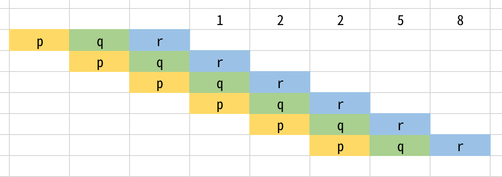
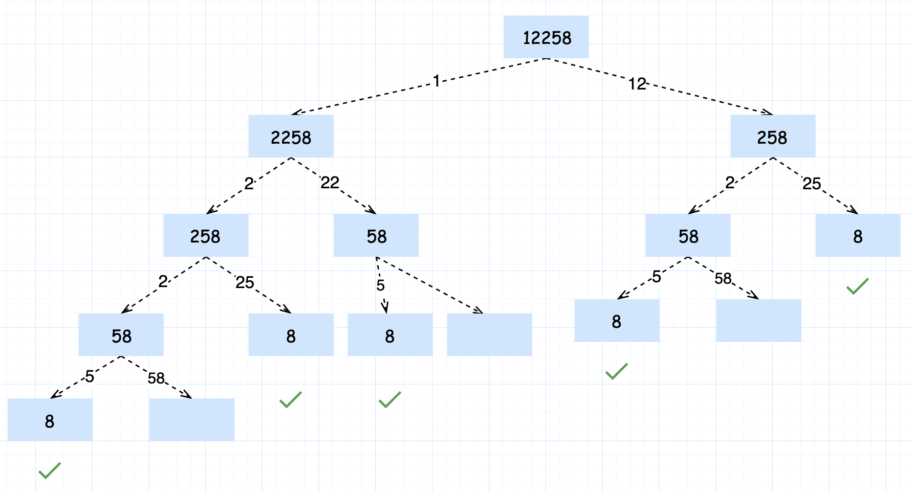
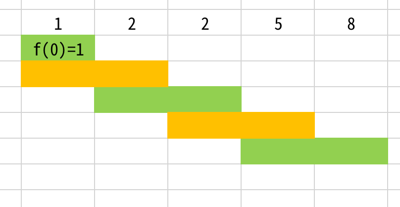

- [剑指 Offer 46. 把数字翻译成字符串](#剑指-offer-46-把数字翻译成字符串)
  - [题目](#题目)
  - [解答](#解答)
    - [动态规划](#动态规划)
    - [非动态规划的方式](#非动态规划的方式)


------------------------------

# 剑指 Offer 46. 把数字翻译成字符串

## 题目

给定一个数字，我们按照如下规则把它翻译为字符串：0 翻译成 “a” ，1 翻译成 “b”，……，11 翻译成 “l”，……，25 翻译成 “z”。一个数字可能有多个翻译。请编程实现一个函数，用来计算一个数字有多少种不同的翻译方法。

示例 1:

```
输入: 12258
输出: 5
解释: 12258有5种不同的翻译，分别是"bccfi", "bwfi", "bczi", "mcfi"和"mzi"
```

提示： 0 <= num < $2^{31}$

- **数字是可以组合起来的**，比如 1402 可以单独翻译，也可以把 14 当作一个数字来翻译。
- 前导 0 的数字不算，比如 `02` 不算数字。

------------------------

- 来源：力扣（LeetCode）
- 链接：https://leetcode-cn.com/problems/ba-shu-zi-fan-yi-cheng-zi-fu-chuan-lcof
- 著作权归领扣网络所有。商业转载请联系官方授权，非商业转载请注明出处。

## 解答

### 动态规划

**思路和算法**

首先我们来通过一个例子理解一下这里「翻译」的过程：我们来尝试翻译「140214021402」。

分成两种情况：

- 首先我们可以把每一位单独翻译，即 $[1, 4, 0, 2]$，翻译的结果是 `beac`.
- 然后我们考虑组合某些连续的两位：
    - $[14, 0, 2]$，翻译的结果是 `oac`。
    - $[1, 40, 2]$，这种情况是不合法的，因为 404040 不能翻译成任何字母。
    - $[1, 4, 02]$，这种情况也是不合法的，含有前导零的两位数不在题目规定的翻译规则中，那么 $[14, 02]$ 显然也是不合法的。

那么我们可以归纳出翻译的规则，字符串的第 $i$ 位置：

- 可以单独作为一位来翻译
- 如果第 $i - 1$ 位和第 $i$ 位组成的数字在 $10$ 到 $25$ 之间，可以把这两位连起来翻译

到这里，我们发现它和「198. 打家劫舍」非常相似。我们可以用 $f(i)$ 表示以第 $i$ 位结尾的前缀串翻译的方案数，考虑第 $i$ 位单独翻译和与前一位连接起来再翻译对 $f(i)$ 的贡献。单独翻译对 $f(i)$ 的贡献为 $f(i - 1)$；如果第 $i - 1$ 位存在，并且第 $i - 1$ 位和第 $i$ 位形成的数字 xxx 满足 $10 \leq x \leq 25$，那么就可以把第 $i - 1$ 位和第 $i$ 位连起来一起翻译，对 $f(i)$ 的贡献为 $f(i - 2)$，否则为 0。我们可以列出这样的动态规划转移方程：

$$
f(i) = f(i - 1) + f(i - 2)[i - 1 \geq 0, 10 \leq x \leq 25]
$$

边界条件是 $f(-1) = 0$(**我觉得应该是 1**)，$f(0) = 1$。方程中 $[c]$ 的意思是 c 为真的时候 $[c] = 1$，否则 $[c] = 0$。

有了这个方程我们不难给出一个时间复杂度为 $O(n)$，空间复杂度为 $O(n)$ 的实现。考虑优化空间复杂度：这里的 $f(i)$ 只和它的前两项 $f(i - 1)$ 和 $f(i - 2)$ 相关，我们可以运用「**滚动数组**」思想把 f 数组压缩成三个变量，这样空间复杂度就变成了 $O(1)$。

```go
func translateNum(num int) int {
    src := strconv.Itoa(num)
    p, q, r := 0, 0, 1
    for i := 0; i < len(src); i++ {
        p, q, r = q, r, 0
        r += q
        if i == 0 {
            continue
        }
        pre := src[i-1:i+1]
        if pre <= "25" && pre >= "10" {
            r += p
        }
    }
    return r
}
```



另外，如果从前往后访问的话，不转换成字符串还真做不到，因为 int 类型的没法直接获取第一个数字。


复杂度分析

记 ${\rm num} = n$。

- 时间复杂度：循环的次数是 n 的位数，故渐进时间复杂度为 $O(\log n)$
- 空间复杂度：虽然这里用了滚动数组，动态规划部分的空间代价是 $O(1)$ 的，但是这里用了一个临时变量把数字转化成了字符串，故渐进空间复杂度也是 $O(\log n)$


### 非动态规划的方式

这个和 ⎡70:爬楼梯⎦ 有点类似。



这张图在求 $f(i)$ 时除了看 $num[i]$ 外，看的是 $num[i]num[i+1]$，上面分析时其实是看的 $num[i-1]num[i]$




在求 $f(i)$ 时有两种选择，1）翻译 $num[i]$；2）翻译 $num[i-1]num[i]$（这个是有条件的，就是在 $[10, 25]$ 这个范围内）。所以：

$$
f(i) =
\begin{cases}
f(i-1) + f(i-2) & num[i-2]num[i-1] \in    [10, 25] \\
f(i-1)          & num[i-2]num[i-1] \notin [10, 25]
\end{cases}
$$

这个可以用递归的方式做:

```js
const translateNum = (num) => {
  const str = num.toString()     
  const dfs = (str, pointer) => {           // 随着dfs向下，pointer右移
    if (pointer >= str.length - 1) return 1 // 指针抵达边界和超出边界都返回1
    const temp = Number(str[pointer] + str[pointer + 1]) // 考察该2位数
    if (temp >= 10 && temp <= 25) {         // 落在[10,25]
      // 他采用的就是向后的方式
      return dfs(str, pointer + 1) + dfs(str, pointer + 2) // 2个分支的结果相加
    } else {                                // 两位数大于25        
      return dfs(str, pointer + 1)          // 只能翻译1位，返回1个分支的结果
    }
  }
  return dfs(str, 0) // dfs的入口，指针起始位置0
}

// 作者：hyj8
// 链接：https://leetcode-cn.com/problems/ba-shu-zi-fan-yi-cheng-zi-fu-chuan-lcof/solution/shou-hui-tu-jie-dfsdi-gui-ji-yi-hua-di-gui-dong-ta/
```

递归的方式可以用备忘录来优化：

```js
const translateNum = (num) => {
  const str = num.toString()
  const n = str.length
  const memo = new Array(n)
  memo[n - 1] = 1   // 指针临界时的子树的计算结果
  memo[n] = 1       // 指针越界时的子树的计算结果
  const dfs = (str, pointer, memo) => {
    if (memo[pointer]) return memo[pointer] // 之前存过，直接拿来用
    const temp = Number(str[pointer] + str[pointer + 1])
    if (temp >= 10 && temp <= 25) { // 两个分支的结果相加 记下来
      memo[pointer] = dfs(str, pointer + 1, memo) + dfs(str, pointer + 2, memo)
    } else { // 只有1个分支，记录递归调用的结果
      memo[pointer] = dfs(str, pointer + 1, memo)
    }
    return memo[pointer] // 当前子树的计算结果向上返回
  }
  return dfs(str, 0, memo) // dfs入口
}

// 作者：hyj8
// 链接：https://leetcode-cn.com/problems/ba-shu-zi-fan-yi-cheng-zi-fu-chuan-lcof/solution/shou-hui-tu-jie-dfsdi-gui-ji-yi-hua-di-gui-dong-ta/
```

