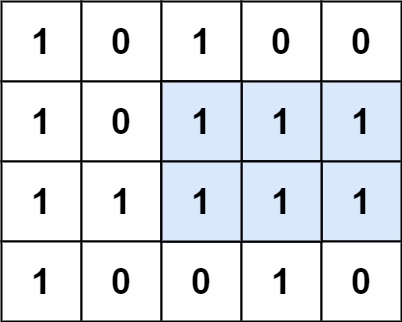
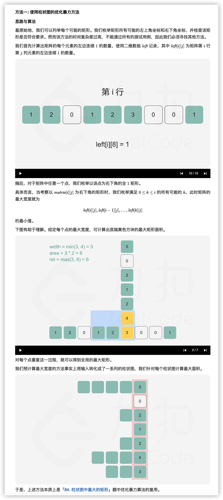

- [50. Pow(x, n)](#50-powx-n)
- [84. 柱状图中最大的矩形](#84-柱状图中最大的矩形)
- [66. 加一](#66-加一)
- [85. 最大矩形](#85-最大矩形)
- [98. 验证二叉搜索树](#98-验证二叉搜索树)

------------------------------

# 50. Pow(x, n)

实现 `pow(x, n)`，即计算 x 的 n 次幂函数（即，$x^n$）。

示例 1：

```
输入：x = 2.00000, n = 10
输出：1024.00000
```

示例 2：

```
输入：x = 2.10000, n = 3
输出：9.26100
```

示例 3：

```
输入：x = 2.00000, n = -2
输出：0.25000
```

解释：$2^{-2} = 1/2^2 = 1/4 = 0.25$

提示：

- $-100.0 < x < 100.0$
- $-2^{31} <= n <= 2^{31}-1$
- $-10^4 <= x^n <= 10^4$

链接：https://leetcode-cn.com/problems/powx-n

**官方题解**

前言

本题的方法被称为「快速幂算法」，有递归和迭代两个版本。这篇题解会从递归版本的开始讲起，再逐步引出迭代的版本。

当指数 $n$ 为负数时，我们可以计算 $x^{-n}$ 再取倒数得到结果，因此我们只需要考虑 $n$ 为自然数的情况。

方法一：快速幂 + 递归

「快速幂算法」的本质是分治算法。举个例子，如果我们要计算 $x^{64}$，我们可以按照：

$$
x \to x^2 \to x^4 \to x^8 \to x^{16} \to x^{32} \to x^{64}
$$

的顺序，从 $x$ 开始，每次直接把上一次的结果进行平方，计算 $6$ 次就可以得到 $x^{64}$ 的值，而不需要对 $x$ 乘 $63$ 次 $x$。

再举一个例子，如果我们要计算 $x^{77}$，我们可以按照：

$$
x \to x^2 \to x^4 \to x^9 \to x^{19} \to x^{38} \to x^{77}
$$

的顺序，在 $x \to x^2$，$x^2 \to x^4$，$x^{19} \to x^{38}$ 这些步骤中，我们直接把上一次的结果进行平方，而在 $x^4 \to x^9$，$x^9 \to x^{19}$，$x^{38} \to x^{77}$ 这些步骤中，我们把上一次的结果进行平方后，还要额外乘一个 $x$。

直接从左到右进行推导看上去很困难，因为在每一步中，我们不知道在将上一次的结果平方之后，还需不需要额外乘 $x$。但如果我们从右往左看，分治的思想就十分明显了：

- 当我们要计算 $x^n$ 时，我们可以先递归地计算出 $y = x^{\lfloor n/2 \rfloor}$，其中 $\lfloor a \rfloor$ 表示对 $a$ 进行下取整；
- 根据递归计算的结果，如果 $n$ 为偶数，那么 $x^n = y^2$；如果 $n$ 为奇数，那么 $x^n = y^2 \times x$；
- 递归的边界为 $n = 0$，任意数的 $0$ 次方均为 $1$。

由于每次递归都会使得指数减少一半，因此递归的层数为 $O(\log n)$，算法可以在很快的时间内得到结果。

```go
func myPow(x float64, n int) float64 {
    if n >= 0 {
        return quickMul(x, n)
    }
    return 1.0 / quickMul(x, -n)
}

func quickMul(x float64, n int) float64 {
    if n == 0 {
        return 1
    }
    y := quickMul(x, n/2)
    if n%2 == 0 {
        return y * y
    }
    return y * y * x
}
```

复杂度分析

- 时间复杂度：$O(\log n)$，即为递归的层数。
- 空间复杂度：$O(\log n)$，即为递归的层数。这是由于递归的函数调用会使用栈空间。

方法二：快速幂 + 迭代

> 这个题解写的不容易理解，可以看下面的。

由于递归需要使用额外的栈空间，我们试着将递归转写为迭代。在方法一中，我们也提到过，从左到右进行推导是不容易的，因为我们不知道是否需要额外乘 $x$。但我们不妨找一找规律，看看哪些地方额外乘了 $x$，并且它们对答案产生了什么影响。

我们还是以 $x^{77}$ 作为例子：

$$
x \to x^2 \to x^4 \to^+ x^9 \to^+ x^{19} \to x^{38} \to^+ x^{77}
$$

并且把需要额外乘 $x$ 的步骤打上了 $+$ 标记。可以发现：

- $x^{38} \to^+ x^{77}$ 中额外乘的 $x$ 在 $x^{77}$ 中贡献了 $x$；
- $x^9 \to^+ x^{19}$ 中额外乘的 $x$ 在之后被平方了 $2$ 次，因此在 $x^{77}$ 中贡献了 $x^{2^2} = x^4$；
- $x^4 \to^+ x^9$ 中额外乘的 $x$ 在之后被平方了 $3$ 次，因此在 $x^{77}$ 中贡献了 $x^{2^3} = x^8$；
- 最初的 $x$ 在之后被平方了 $6$ 次，因此在 $x^{77}$ 中贡献了 $x^{2^6} = x^{64}$。

我们把这些贡献相乘，$x \times x^4 \times x^8 \times x^{64}$ 恰好等于 $x^{77}$。而这些贡献的指数部分又是什么呢？它们都是 $2$ 的幂次，这是因为每个额外乘的 $x$ 在之后都会被平方若干次。而这些指数 $1$，$4$，$8$ 和 $64$，恰好就对应了 $77$ 的二进制表示 $(1001101)_2$​ 中的每个 $1$！

因此我们借助整数的二进制拆分，就可以得到迭代计算的方法，一般地，如果整数 $n$ 的二进制拆分为

$$
n = 2^{i_0} + 2^{i_1} + \cdots + 2^{i_k}
$$

那么

$$
x^n = x^{2^{i_0}} \times x^{2^{i_1}} \times \cdots \times x^{2^{i_k}}
$$

这样以来，我们从 $x$ 开始不断地进行平方，得到 $x^2, x^4, x^8, x^{16}, \cdots$，如果 $n$ 的第 $k$ 个（从右往左，从 $0$ 开始计数）二进制位为 $1$，那么我们就将对应的贡献 $x^{2^k}$计入答案。

```go
func myPow(x float64, n int) float64 {
    if n >= 0 {
        return quickMul(x, n)
    }
    return 1.0 / quickMul(x, -n)
}

func quickMul(x float64, N int) float64 {
    ans := 1.0
    // 贡献的初始值为 x
    x_contribute := x
    // 在对 N 进行二进制拆分的同时计算答案
    for N > 0 {
        if N % 2 == 1 {
            // 如果 N 二进制表示的最低位为 1，那么需要计入贡献
            ans *= x_contribute
        }
        // 将贡献不断地平方
        x_contribute *= x_contribute
        // 舍弃 N 二进制表示的最低位，这样我们每次只要判断最低位即可
        N /= 2
    }
    return ans
}
```

复杂度分析

- 时间复杂度：$O(\log n)$，即为对 $n$ 进行二进制拆分的时间复杂度。
- 空间复杂度：$O(1)$。

链接：https://leetcode-cn.com/problems/powx-n/solution/powx-n-by-leetcode-solution/

--------------------

> 下面这个题解比较容易懂。[链接](https://leetcode-cn.com/problems/powx-n/solution/50-powx-n-kuai-su-mi-qing-xi-tu-jie-by-jyd/)


# 84. 柱状图中最大的矩形

给定 n 个非负整数，用来表示柱状图中各个柱子的高度。每个柱子彼此相邻，且宽度为 1 。

求在该柱状图中，能够勾勒出来的矩形的最大面积。


以上是柱状图的示例，其中每个柱子的宽度为 1，给定的高度为 `[2,1,5,6,2,3]`。


图中阴影部分为所能勾勒出的最大矩形面积，其面积为 10 个单位。

链接：https://leetcode-cn.com/problems/largest-rectangle-in-histogram/

**官方题解**

链接：https://leetcode-cn.com/problems/largest-rectangle-in-histogram/solution/zhu-zhuang-tu-zhong-zui-da-de-ju-xing-by-leetcode-/

官方题解太难懂了，不过视频讲解的还可以，建议看下。


```go
func largestRectangleArea(heights []int) int {
    n := len(heights)
    left, right := make([]int, n), make([]int, n)
    mono_stack := []int{}
    for i := 0; i < n; i++ {
        // 把所有 >= height[i] 的都弹走。
        for len(mono_stack) > 0 && heights[mono_stack[len(mono_stack)-1]] >= heights[i] {
            mono_stack = mono_stack[:len(mono_stack)-1]
        }
        if len(mono_stack) == 0 {
            left[i] = -1
        } else {
            // left[i] 记录的是 i 左侧最近的比 height[i] 小的下标。
            left[i] = mono_stack[len(mono_stack)-1]
        }
        mono_stack = append(mono_stack, i)
    }
    mono_stack = []int{}
    for i := n - 1; i >= 0; i-- {
        for len(mono_stack) > 0 && heights[mono_stack[len(mono_stack)-1]] >= heights[i] {
            mono_stack = mono_stack[:len(mono_stack)-1]
        }
        if len(mono_stack) == 0 {
            right[i] = n
        } else {
            right[i] = mono_stack[len(mono_stack)-1]
        }
        mono_stack = append(mono_stack, i)
    }
    ans := 0
    for i := 0; i < n; i++ {
        // left 和 right 之间的，不包括 left 和 right。
        ans = max(ans, (right[i] - left[i] - 1) * heights[i])
    }
    return ans
}

func max(x, y int) int {
    if x > y {
        return x
    }
    return y
}
```

复杂度分析

- 时间复杂度：$O(N)$。
- 空间复杂度：$O(N)$。

**方法二：单调栈 + 常数优化**

在方法一中，我们首先从左往右对数组进行遍历，借助单调栈求出了每根柱子的左边界，随后从右往左对数组进行遍历，借助单调栈求出了每根柱子的右边界。那么我们是否可以只遍历一次就求出答案呢？

答案是可以的。在方法一中，我们在对位置 i 进行入栈操作时，确定了它的左边界。从直觉上来说，与之对应的我们在对位置 i 进行**出栈操作时可以确定它的右边界**！仔细想一想，这确实是对的。当位置 i 被弹出栈时，说明此时遍历到的位置 $i_0$​ 的高度小于等于 $\textit{height}[i]$，并且在 $i_0$​ 与 i 之间没有其他高度小于等于 $\textit{height}[i]$ 的柱子。这是因为，如果在 i 和 $i_0$​ 之间还有其它位置的高度小于等于 $\textit{height}[i]$ 的，那么在遍历到那个位置的时候，i 应该已经被弹出栈了。所以位置 $i_0$​ 就是位置 i 的右边界。

等等，我们需要的是「一根柱子的左侧且最近的小于其高度的柱子」，但这里我们求的是小于等于，那么会造成什么影响呢？答案是：我们确实无法求出正确的右边界，但对最终的答案没有任何影响。这是因为在答案对应的矩形中，如果有若干个柱子的高度都等于矩形的高度，那么最右侧的那根柱子是可以求出正确的右边界的，而我们没有对求出左边界的算法进行任何改动，因此最终的答案还是可以从最右侧的与矩形高度相同的柱子求得的。读者可以仔细思考一下这一步。

在遍历结束后，栈中仍然有一些位置，这些位置对应的右边界就是位置为 n 的「哨兵」。我们可以将它们依次出栈并更新右边界，也可以在初始化右边界数组时就将所有的元素的值置为 n。

```go
func largestRectangleArea(heights []int) int {
    n := len(heights)
    left, right := make([]int, n), make([]int, n)
    for i := 0; i < n; i++ {
        right[i] = n
    }
    mono_stack := []int{}
    for i := 0; i < n; i++ {
        for len(mono_stack) > 0 && heights[mono_stack[len(mono_stack)-1]] >= heights[i] {
            // 找到比 i 高的，它的右边界就是当前下标，然后把它弹出去。
            // 那弹出去的那个下标的左边界是谁呢？应该是前面那个下标，如果它和前面那个下标的高度相同呢？
            right[mono_stack[len(mono_stack)-1]] = i
            mono_stack = mono_stack[:len(mono_stack)-1]
        }
        if len(mono_stack) == 0 {
            left[i] = -1
        } else {
            left[i] = mono_stack[len(mono_stack)-1]
        }
        mono_stack = append(mono_stack, i)
    }
    ans := 0
    for i := 0; i < n; i++ {
        ans = max(ans, (right[i] - left[i] - 1) * heights[i])
    }
    return ans
}

func max(x, y int) int {
    if x > y {
        return x
    }
    return y
}
```

复杂度分析

- 时间复杂度：$O(N)$。
- 空间复杂度：$O(N)$。


------------------------------

下面的截图是截取的[这个题解](https://leetcode-cn.com/problems/largest-rectangle-in-histogram/solution/bao-li-jie-fa-zhan-by-liweiwei1419/)的。


> 上面截图看不清楚的内容是：这是因为我们就是想确定 6 的宽度，6 的宽度确定完了，其实我们就不需要它了，这个 5 的高度和这个 5 的

```java
import java.util.ArrayDeque;
import java.util.Deque;

public class Solution {

    public int largestRectangleArea(int[] heights) {
        int len = heights.length;
        if (len == 0) {
            return 0;
        }
        if (len == 1) {
            return heights[0];
        }

        int res = 0;
        Deque<Integer> stack = new ArrayDeque<>(len);
        for (int i = 0; i < len; i++) {
            // 这个 while 很关键，因为有可能不止一个柱形的最大宽度可以被计算出来
            while (!stack.isEmpty() && heights[i] < heights[stack.peekLast()]) { // 栈顶比当前元素的高度大。
                int curHeight = heights[stack.pollLast()];
                // 如果是相同的，那么也弹出去，这样计算宽度的时候就不会出错了。
                while (!stack.isEmpty() && heights[stack.peekLast()] == curHeight) {
                    stack.pollLast();
                }

                int curWidth;
                if (stack.isEmpty()) {
                    curWidth = i;
                } else {
                    // 因为是递增的（不是单调递增），所以它前面的比它矮。
                    curWidth = i - stack.peekLast() - 1;
                }

                res = Math.max(res, curHeight * curWidth);
            }
            stack.addLast(i);
        }

        while (!stack.isEmpty()) {
            int curHeight = heights[stack.pollLast()];
            while (!stack.isEmpty() && heights[stack.peekLast()] == curHeight) {
                stack.pollLast();
            }
            int curWidth;
            if (stack.isEmpty()) {
                curWidth = len;
            } else {
                curWidth = len - stack.peekLast() - 1;
            }
            res = Math.max(res, curHeight * curWidth);
        }
        return res;
    }
}
```

下面的是加入了哨兵的版本：

```java
import java.util.ArrayDeque;
import java.util.Deque;

public class Solution {

    public int largestRectangleArea(int[] heights) {
        int len = heights.length;
        if (len == 0) {
            return 0;
        }

        if (len == 1) {
            return heights[0];
        }

        int res = 0;

        // 在前后都加入一个高度为 0 的哨兵。
        int[] newHeights = new int[len + 2];
        newHeights[0] = 0;
        System.arraycopy(heights, 0, newHeights, 1, len);
        newHeights[len + 1] = 0;
        len += 2;
        heights = newHeights;

        Deque<Integer> stack = new ArrayDeque<>(len);
        // 先放入哨兵，在循环里就不用做非空判断
        stack.addLast(0);
        
        for (int i = 1; i < len; i++) { // 这里从 1 开始的，是不是就不用在 heights 前面加哨兵了？
            while (heights[i] < heights[stack.peekLast()]) {
                // 这里没有处理两个下标的高度相同的情况。
                int curHeight = heights[stack.pollLast()];
                int curWidth = i - stack.peekLast() - 1;
                res = Math.max(res, curHeight * curWidth);
            }
            stack.addLast(i);
        }
        return res;
    }

    public static void main(String[] args) {
        // int[] heights = {2, 1, 5, 6, 2, 3};
        int[] heights = {1, 1};
        Solution solution = new Solution();
        int res = solution.largestRectangleArea(heights);
        System.out.println(res);
    }
}
```

> 为什么可以不需要处理相同高度的情况？
>
> 如果两个下标 i 和 j 对应的高度是一样的，那么它们最后计算出来的面积应该是一样大的（左边界一样，右边界也一样）。所以计算 j 的时候计算对了就可以了。


# 66. 加一

给定一个由 整数 组成的 非空 数组所表示的非负整数，在该数的基础上加一。

最高位数字存放在数组的首位， 数组中每个元素只存储单个数字。

你可以假设除了整数 0 之外，这个整数不会以零开头。

示例 1：

```
输入：digits = [1,2,3]
输出：[1,2,4]
解释：输入数组表示数字 123。
```

示例 2：

```
输入：digits = [4,3,2,1]
输出：[4,3,2,2]
解释：输入数组表示数字 4321。
```

示例 3：

```
输入：digits = [0]
输出：[1]
```

提示：

- 1 <= digits.length <= 100
- 0 <= digits[i] <= 9

[链接](https://leetcode-cn.com/problems/plus-one)

**我的题解**

```rs
pub fn plus_one(mut digits: Vec<i32>) -> Vec<i32> {
    let mut carry = 1;
    for n in digits.iter_mut().rev() {
        *n += carry;

        if *n <= 9 {
            carry = 0;
            break;
        }

        *n -= 10;
        carry = 1;
    }

    if carry > 0 {
        digits.insert(0, carry);
    }

    digits
}
```

官方题解是找后面有多少 9，把右边第一个不是 9 的加 1，然后把它右边的 9 都变成 0 就可以了。但我觉得如果 9 比较多，还得遍历两遍，有点不好。


# 85. 最大矩形

给定一个仅包含 0 和 1 、大小为 rows x cols 的二维二进制矩阵，找出只包含 1 的最大矩形，并返回其面积。

示例 1：



```
输入：matrix = [["1","0","1","0","0"],["1","0","1","1","1"],["1","1","1","1","1"],["1","0","0","1","0"]]
输出：6
解释：最大矩形如上图所示。
```

示例 2：

```
输入：matrix = []
输出：0
```

示例 3：

```
输入：matrix = [["0"]]
输出：0
```

示例 4：

```
输入：matrix = [["1"]]
输出：1
```

示例 5：

```
输入：matrix = [["0","0"]]
输出：0
```

提示：

- rows == matrix.length
- cols == `matrix[0].length`
- 0 <= row, cols <= 200
- `matrix[i][j]` 为 '0' 或 '1'

链接：https://leetcode-cn.com/problems/maximal-rectangle

**官方题解**



```go
func maximalRectangle(matrix [][]byte) (ans int) {
    if len(matrix) == 0 {
        return
    }
    m, n := len(matrix), len(matrix[0])
    // 每个点连续 1 的个数。
    left := make([][]int, m)
    for i, row := range matrix {
        left[i] = make([]int, n)
        for j, v := range row {
            if v == '0' {
                continue
            }
            if j == 0 {
                left[i][j] = 1
            } else {
                left[i][j] = left[i][j-1] + 1
            }
        }
    }
    for i, row := range matrix {
        for j, v := range row {
            if v == '0' {
                continue
            }
            // 以 [i][j] 为右下角时矩阵的面积。
            width := left[i][j]
            area := width
            for k := i - 1; k >= 0; k-- {
                width = min(width, left[k][j])
                area = max(area, (i-k+1)*width)
            }
            ans = max(ans, area)
        }
    }
    return
}

func min(a, b int) int {
    if a < b {
        return a
    }
    return b
}

func max(a, b int) int {
    if a > b {
        return a
    }
    return b
}
```

复杂度分析

- 时间复杂度：$O(m^2n)$，其中 m 和 n 分别是矩阵的行数和列数。计算 left 矩阵需要 $O(mn)$ 的时间。随后对于矩阵的每个点，需要 $O(m)$ 的时间枚举高度。故总的时间复杂度为 $O(mn) + O(mn) \cdot O(m) = O(m^2n)$。
- 空间复杂度：$O(mn)$，其中 m 和 n 分别是矩阵的行数和列数。我们分配了一个与给定矩阵等大的数组，用于存储每个元素的左边连续 1 的数量。

方法二：单调栈

思路与算法

在方法一中，我们讨论了将输入拆分成一系列的柱状图。为了计算矩形的最大面积，我们只需要计算每个柱状图中的最大面积，并找到全局最大值。

我们可以使用[「84. 柱状图中最大的矩形的官方题解」](https://leetcode-cn.com/problems/largest-rectangle-in-histogram/solution/zhu-zhuang-tu-zhong-zui-da-de-ju-xing-by-leetcode-/)中的单调栈的做法，将其应用在我们生成的柱状图中。

```go
func maximalRectangle(matrix [][]byte) (ans int) {
    if len(matrix) == 0 {
        return
    }
    m, n := len(matrix), len(matrix[0])
    // 每个点连续 1 的数量。
    left := make([][]int, m)
    for i, row := range matrix {
        left[i] = make([]int, n)
        for j, v := range row {
            if v == '0' {
                continue
            }
            if j == 0 {
                left[i][j] = 1
            } else {
                left[i][j] = left[i][j-1] + 1
            }
        }
    }
    // 像是倒了的柱状图，第 j 列是 x 轴。
    for j := 0; j < n; j++ { // 对于每一列，使用基于柱状图的方法
        up := make([]int, m)
        down := make([]int, m)
        stk := []int{}
        for i, l := range left {
            for len(stk) > 0 && left[stk[len(stk)-1]][j] >= l[j] {
                stk = stk[:len(stk)-1]
            }
            up[i] = -1
            if len(stk) > 0 {
                up[i] = stk[len(stk)-1]
            }
            stk = append(stk, i)
        }
        stk = nil
        for i := m - 1; i >= 0; i-- {
            for len(stk) > 0 && left[stk[len(stk)-1]][j] >= left[i][j] {
                stk = stk[:len(stk)-1]
            }
            down[i] = m
            if len(stk) > 0 {
                down[i] = stk[len(stk)-1]
            }
            stk = append(stk, i)
        }
        for i, l := range left {
            height := down[i] - up[i] - 1
            area := height * l[j]
            ans = max(ans, area)
        }
    }
    return
}

func max(a, b int) int {
    if a > b {
        return a
    }
    return b
}
```

读者可以自行比对上面的代码与此前第 84 题的代码的相似之处。

复杂度分析

- 时间复杂度：$O(mn)$，其中 m 和 n 分别是矩阵的行数和列数。计算 left 矩阵需要 $O(mn)$ 的时间；对每一列应用柱状图算法需要 $O(m)$ 的时间，一共需要 $O(mn)$ 的时间。
- 空间复杂度：$O(mn)$，其中 m 和 n 分别是矩阵的行数和列数。我们分配了一个与给定矩阵等大的数组，用于存储每个元素的左边连续 1 的数量。

链接：https://leetcode-cn.com/problems/maximal-rectangle/solution/zui-da-ju-xing-by-leetcode-solution-bjlu/


# 98. 验证二叉搜索树

给定一个二叉树，判断其是否是一个有效的二叉搜索树。

假设一个二叉搜索树具有如下特征：

- 节点的左子树只包含小于当前节点的数。
- 节点的右子树只包含大于当前节点的数。
- 所有左子树和右子树自身必须也是二叉搜索树。

示例 1:

```
输入:
    2
   / \
  1   3
输出: true
```

示例 2:

```
输入:
    5
   / \
  1   4
     / \
    3   6
输出: false
解释: 输入为: [5,1,4,null,null,3,6]。
     根节点的值为 5 ，但是其右子节点值为 4 。
```

链接：https://leetcode-cn.com/problems/validate-binary-search-tree

**官方题解**

方法一: 递归

要解决这道题首先我们要了解二叉搜索树有什么性质可以给我们利用，由题目给出的信息我们可以知道：如果该二叉树的左子树不为空，则左子树上所有节点的值均小于它的根节点的值； 若它的右子树不空，则右子树上所有节点的值均大于它的根节点的值；它的左右子树也为二叉搜索树。

这启示我们设计一个递归函数 `helper(root, lower, upper)` 来递归判断，函数表示考虑以 root 为根的子树，判断子树中所有节点的值是否都在 $(l,r)$ 的范围内（注意是开区间）。如果 root 节点的值 val 不在 $(l,r)$ 的范围内说明不满足条件直接返回，否则我们要继续递归调用检查它的左右子树是否满足，如果都满足才说明这是一棵二叉搜索树。

那么根据二叉搜索树的性质，在递归调用左子树时，我们需要把上界 upper 改为 `root.val`，即调用 `helper(root.left, lower, root.val)`，因为左子树里所有节点的值均小于它的根节点的值。同理递归调用右子树时，我们需要把下界 lower 改为 `root.val`，即调用 `helper(root.right, root.val, upper)`。

函数递归调用的入口为 `helper(root, -inf, +inf)`， inf 表示一个无穷大的值。

```go
func isValidBST(root *TreeNode) bool {
    return helper(root, math.MinInt64, math.MaxInt64)
}

func helper(root *TreeNode, lower, upper int) bool {
    if root == nil {
        return true
    }
    if root.Val <= lower || root.Val >= upper {
        return false
    }
    return helper(root.Left, lower, root.Val) && helper(root.Right, root.Val, upper)
}
```

复杂度分析

- 时间复杂度 : $O(n)$，其中 $n$ 为二叉树的节点个数。在递归调用的时候二叉树的每个节点最多被访问一次，因此时间复杂度为 $O(n)$。
- 空间复杂度 : $O(n)$，其中 $n$ 为二叉树的节点个数。递归函数在递归过程中需要为每一层递归函数分配栈空间，所以这里需要额外的空间且该空间取决于递归的深度，即二叉树的高度。最坏情况下二叉树为一条链，树的高度为 $n$ ，递归最深达到 $n$ 层，故最坏情况下空间复杂度为 $O(n)$ 。

方法二：中序遍历

思路和算法

基于方法一中提及的性质，我们可以进一步知道二叉搜索树「中序遍历」得到的值构成的序列一定是升序的，这启示我们在中序遍历的时候实时检查当前节点的值是否大于前一个中序遍历到的节点的值即可。如果均大于说明这个序列是升序的，整棵树是二叉搜索树，否则不是，下面的代码我们使用栈来模拟中序遍历的过程。

可能由读者不知道中序遍历是什么，我们这里简单提及一下，中序遍历是二叉树的一种遍历方式，它先遍历左子树，再遍历根节点，最后遍历右子树。而我们二叉搜索树保证了左子树的节点的值均小于根节点的值，根节点的值均小于右子树的值，因此中序遍历以后得到的序列一定是升序序列。


```go
func isValidBST(root *TreeNode) bool {
    stack := []*TreeNode{}
    inorder := math.MinInt64
    for len(stack) > 0 || root != nil {
        for root != nil {
            stack = append(stack, root)
            root = root.Left
        }
        root = stack[len(stack)-1]
        stack = stack[:len(stack)-1]
        if root.Val <= inorder {
            return false
        }
        inorder = root.Val
        root = root.Right
    }
    return true
}
```

复杂度分析

- 时间复杂度 : $O(n)$，其中 $n$ 为二叉树的节点个数。二叉树的每个节点最多被访问一次，因此时间复杂度为 $O(n)$。
- 空间复杂度 : $O(n)$，其中 $n$ 为二叉树的节点个数。栈最多存储 $n$ 个节点，因此需要额外的 $O(n)$ 的空间。

链接：https://leetcode-cn.com/problems/validate-binary-search-tree/solution/yan-zheng-er-cha-sou-suo-shu-by-leetcode-solution/