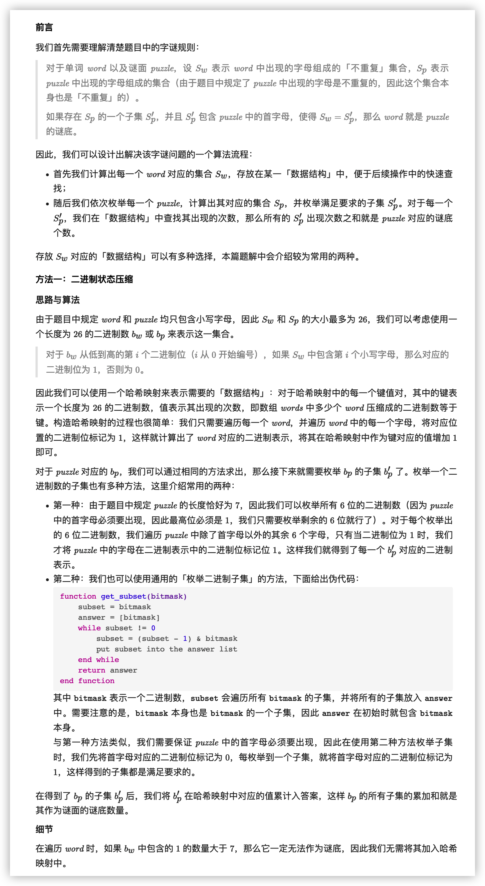
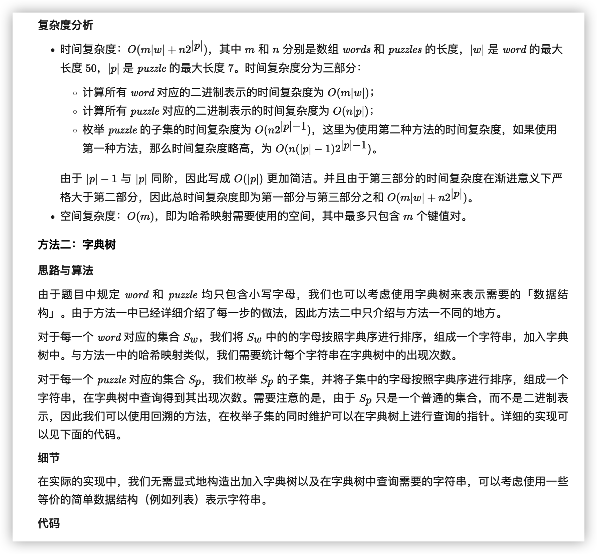
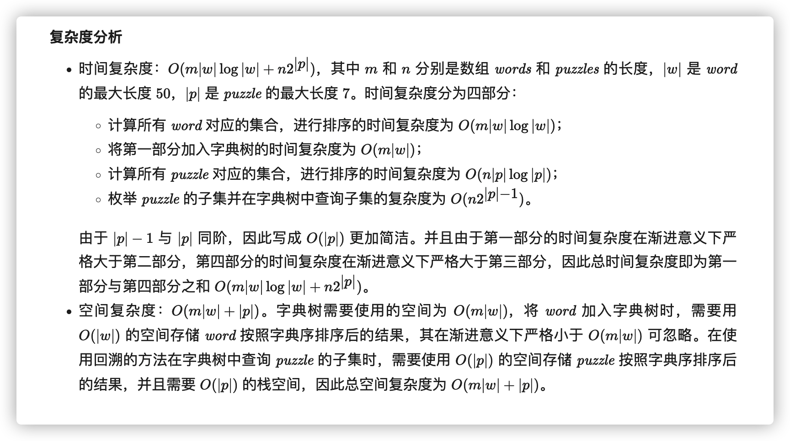

- [1178. 猜字谜](#1178-猜字谜)


------------------------------

# 1178. 猜字谜

外国友人仿照中国字谜设计了一个英文版猜字谜小游戏，请你来猜猜看吧。

字谜的迷面 puzzle 按字符串形式给出，如果一个单词 word 符合下面两个条件，那么它就可以算作谜底：

- 单词 word 中包含谜面 puzzle 的第一个字母。
- 单词 word 中的每一个字母都可以在谜面 puzzle 中找到。
    
    例如，如果字谜的谜面是 "abcdefg"，那么可以作为谜底的单词有 "faced", "cabbage", 和 "baggage"；而 "beefed"（不含字母 "a"）以及 "based"（其中的 "s" 没有出现在谜面中）。

返回一个答案数组 answer，数组中的每个元素 `answer[i]` 是在给出的单词列表 words 中可以作为字谜迷面 `puzzles[i]` 所对应的谜底的单词数目。

示例：

```
输入：
words = ["aaaa","asas","able","ability","actt","actor","access"], 
puzzles = ["aboveyz","abrodyz","abslute","absoryz","actresz","gaswxyz"]
输出：[1,1,3,2,4,0]
解释：
1 个单词可以作为 "aboveyz" 的谜底 : "aaaa" 
1 个单词可以作为 "abrodyz" 的谜底 : "aaaa"
3 个单词可以作为 "abslute" 的谜底 : "aaaa", "asas", "able"
2 个单词可以作为 "absoryz" 的谜底 : "aaaa", "asas"
4 个单词可以作为 "actresz" 的谜底 : "aaaa", "asas", "actt", "access"
没有单词可以作为 "gaswxyz" 的谜底，因为列表中的单词都不含字母 'g'。
```
 
提示：

- 1 <= words.length <= 10^5
- 4 <= `words[i].length` <= 50
- 1 <= puzzles.length <= 10^4
- `puzzles[i].length` == 7
- `words[i][j]`, `puzzles[i][j]` 都是小写英文字母。
- 每个 `puzzles[i]` 所包含的字符都不重复。

链接：https://leetcode-cn.com/problems/number-of-valid-words-for-each-puzzle

**官方题解**




```go
func findNumOfValidWords(words []string, puzzles []string) []int {
    const puzzleLength = 7
    cnt := map[int]int{}
    for _, s := range words {
        // 如果字符出现，则标记为 1
        mask := 0
        for _, ch := range s {
            mask |= 1 << (ch - 'a')
        }
        // 为什么要检查 1 的个数？
        // 如果 1 的个数比 7 多，说明 word 中不重复的字符要多于 puzzle 的字符，就不满足第二条规则了。
        if bits.OnesCount(uint(mask)) <= puzzleLength {
            cnt[mask]++
        }
    }

    ans := make([]int, len(puzzles))
    for i, s := range puzzles {
        first := 1 << (s[0] - 'a')

        // 枚举子集方法一
        // choose 的二进制中1表示要选择 puzzle 的哪个字符。比如 0b_0011 表示选择 puzzle 中的 uz。
        //for choose := 0; choose < 1<<(puzzleLength-1); choose++ {
        //    mask := 0
        //    for j := 0; j < puzzleLength-1; j++ {
        //        if choose>>j&1 == 1 { // 如果第 j 位是 1，那么就把相应字符的二进制点亮。
        //            mask |= 1 << (s[j+1] - 'a')
        //        }
        //    }
        //    ans[i] += cnt[mask|first]
        //}

        // 枚举子集方法二
        // 除第一位之外的字符的二进制表示。
        mask := 0
        for _, ch := range s[1:] {
            mask |= 1 << (ch - 'a')
        }
        subset := mask
        for {
            ans[i] += cnt[subset|first] // 加上了第一位
            subset = (subset - 1) & mask // 下一个子集
            if subset == mask {
                break
            }
        }
    }
    return ans
}
```



```go
type trieNode struct {
    son [26]*trieNode
    cnt int
}

func findNumOfValidWords(words []string, puzzles []string) []int {
    root := &trieNode{}
    for _, word := range words {
        // 将 word 中的字母按照字典序排序并去重
        w := []byte(word)
        sort.Slice(w, func(i, j int) bool { return w[i] < w[j] })
        i := 0
        for _, ch := range w[1:] {
            if w[i] != ch {
                i++
                w[i] = ch
            }
        }
        w = w[:i+1]

        // 加入字典树中
        cur := root
        for _, ch := range w {
            ch -= 'a'
            if cur.son[ch] == nil {
                cur.son[ch] = &trieNode{}
            }
            cur = cur.son[ch]
        }
        cur.cnt++
    }

    ans := make([]int, len(puzzles))
    for i, puzzle := range puzzles {
        pz := []byte(puzzle)
        first := pz[0]
        sort.Slice(pz, func(i, j int) bool { return pz[i] < pz[j] })

        // 在回溯的过程中枚举 pz 的所有子集并统计答案
        var find func(int, *trieNode) int
        find = func(pos int, cur *trieNode) int {
            // 搜索到空节点，不合法，返回 0
            if cur == nil {
                return 0
            }

            // 整个 pz 搜索完毕，返回谜底的数量
            if pos == len(pz) {
                return cur.cnt
            }

            // 选择第 pos 个字母
            res := find(pos+1, cur.son[pz[pos]-'a'])

            // 当 pz[pos] 不为首字母时，可以不选择第 pos 个字母
            if pz[pos] != first {
                res += find(pos+1, cur)
            }

            return res
        }

        ans[i] = find(0, root)
    }

    return ans
}
```



链接：https://leetcode-cn.com/problems/number-of-valid-words-for-each-puzzle/solution/cai-zi-mi-by-leetcode-solution-345u/