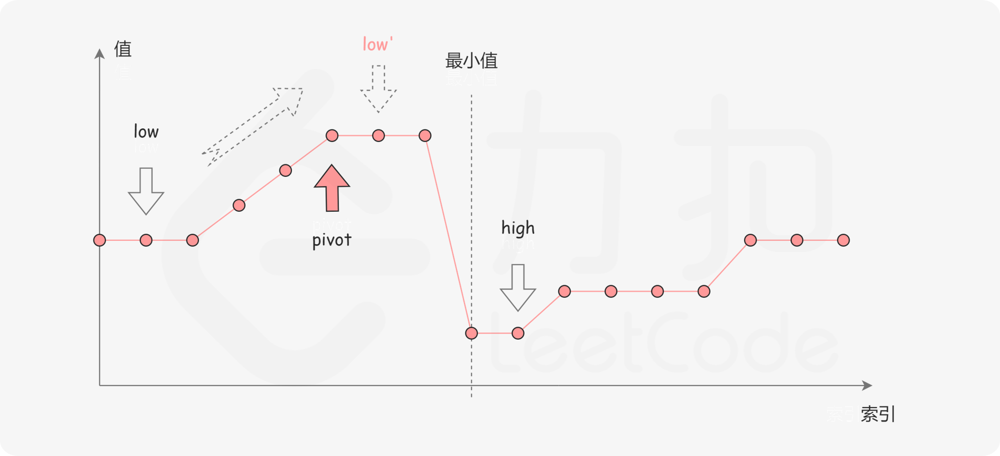

- [101. 对称二叉树](#101-对称二叉树)
- [121. 买卖股票的最佳时机](#121-买卖股票的最佳时机)
- [122. 买卖股票的最佳时机 II](#122-买卖股票的最佳时机-ii)
- [153. 寻找旋转排序数组中的最小值](#153-寻找旋转排序数组中的最小值)
- [154. 寻找旋转排序数组中的最小值 II](#154-寻找旋转排序数组中的最小值-ii)

------------------------------

# 101. 对称二叉树

给你一个二叉树的根节点 root ， 检查它是否轴对称。

```
示例 1：
输入：root = [1,2,2,3,4,4,3]
输出：true

示例 2：
输入：root = [1,2,2,null,3,null,3]
输出：false
```

提示：

- 树中节点数目在范围 [1, 1000] 内
- -100 <= Node.val <= 100

进阶：你可以运用递归和迭代两种方法解决这个问题吗？

链接：https://leetcode-cn.com/problems/symmetric-tree

**官方题解**

**方法一：递归**

如果一个树的左子树与右子树镜像对称，那么这个树是对称的。


因此，该问题可以转化为：两个树在什么情况下互为镜像？

如果同时满足下面的条件，两个树互为镜像：

- 它们的两个根结点具有相同的值
- 每个树的右子树都与另一个树的左子树镜像对称

我们可以实现这样一个递归函数，通过「同步移动」两个指针的方法来遍历这棵树，p 指针和 q 指针一开始都指向这棵树的根，随后 p 右移时，q 左移，p 左移时，q 右移。每次检查当前 p 和 q 节点的值是否相等，如果相等再判断左右子树是否对称。

```go
func isSymmetric(root *TreeNode) bool {
    return check(root, root)
}

func check(p, q *TreeNode) bool {
    if p == nil && q == nil {
        return true
    }
    if p == nil || q == nil {
        return false
    }
    return p.Val == q.Val && check(p.Left, q.Right) && check(p.Right, q.Left) 
}
```

复杂度分析

假设树上一共 $n$ 个节点。

- 时间复杂度：这里遍历了这棵树，渐进时间复杂度为 $O(n)$。
- 空间复杂度：这里的空间复杂度和递归使用的栈空间有关，这里递归层数不超过 $n$，故渐进空间复杂度为 $O(n)$。

**方法二：迭代**

「方法一」中我们用递归的方法实现了对称性的判断，那么如何用迭代的方法实现呢？首先我们引入一个队列，这是把递归程序改写成迭代程序的常用方法。初始化时我们把根节点入队两次。每次提取两个结点并比较它们的值（队列中每两个连续的结点应该是相等的，而且它们的子树互为镜像），然后将两个结点的左右子结点按相反的顺序插入队列中。当队列为空时，或者我们检测到树不对称（即从队列中取出两个不相等的连续结点）时，该算法结束。

```go
func isSymmetric(root *TreeNode) bool {
    u, v := root, root
    q := []*TreeNode{}
    q = append(q, u)
    q = append(q, v)
    for len(q) > 0 {
        u, v = q[0], q[1]
        q = q[2:]
        if u == nil && v == nil {
            continue
        }
        if u == nil || v == nil {
            return false
        }
        if u.Val != v.Val {
            return false
        }
        q = append(q, u.Left)
        q = append(q, v.Right)

        q = append(q, u.Right)
        q = append(q, v.Left)
    }
    return true
}
```

复杂度分析

- 时间复杂度：$O(n)$，同「方法一」。
- 空间复杂度：这里需要用一个队列来维护节点，每个节点最多进队一次，出队一次，队列中最多不会超过 $n$ 个点，故渐进空间复杂度为 $O(n)$。


# 121. 买卖股票的最佳时机

给定一个数组 prices ，它的第 i 个元素 $prices[i]$ 表示一支给定股票第 i 天的价格。

你只能选择 某一天 买入这只股票，并选择在 未来的某一个不同的日子 卖出该股票。设计一个算法来计算你所能获取的最大利润。

返回你可以从这笔交易中获取的最大利润。如果你不能获取任何利润，返回 0。

> 只能买卖一次吗？

示例 1：

```
输入：[7,1,5,3,6,4]
输出：5
解释：在第 2 天（股票价格 = 1）的时候买入，在第 5 天（股票价格 = 6）的时候卖出，最大利润 = 6-1 = 5 。
     注意利润不能是 7-1 = 6, 因为卖出价格需要大于买入价格；同时，你不能在买入前卖出股票。
```

示例 2：

```
输入：prices = [7,6,4,3,1]
输出：0
解释：在这种情况下, 没有交易完成, 所以最大利润为 0。
```

提示：

- $1 <= prices.length <= 10^5$
- $0 <= prices[i] <= 10^4$

链接：https://leetcode-cn.com/problems/best-time-to-buy-and-sell-stock

> 第一次想法：
> [0, m] 这个区间内，最大的利润应该是 min(0, m-1) 和 m 之间的差值。所以找到前面的最小值就可以了。


# 122. 买卖股票的最佳时机 II

给定一个数组 prices ，其中 $prices[i]$ 表示股票第 i 天的价格。

在每一天，你可能会决定购买和/或出售股票。你在任何时候 最多 只能持有 一股 股票。你也可以购买它，然后在 同一天 出售。
返回 你能获得的 最大 利润 。

示例 1:

```
输入: prices = [7,1,5,3,6,4]
输出: 7
解释: 在第 2 天（股票价格 = 1）的时候买入，在第 3 天（股票价格 = 5）的时候卖出, 这笔交易所能获得利润 = 5-1 = 4 。
     随后，在第 4 天（股票价格 = 3）的时候买入，在第 5 天（股票价格 = 6）的时候卖出, 这笔交易所能获得利润 = 6-3 = 3 。
```

示例 2:

```
输入: prices = [1,2,3,4,5]
输出: 4
解释: 在第 1 天（股票价格 = 1）的时候买入，在第 5 天 （股票价格 = 5）的时候卖出, 这笔交易所能获得利润 = 5-1 = 4 。
     注意你不能在第 1 天和第 2 天接连购买股票，之后再将它们卖出。因为这样属于同时参与了多笔交易，你必须在再次购买前出售掉之前的股票。
```

示例 3:

```
输入: prices = [7,6,4,3,1]
输出: 0
解释: 在这种情况下, 没有交易完成, 所以最大利润为 0。
```

提示：

- $1 <= prices.length <= 3 * 10^4$
- $0 <= prices[i] <= 10^4$

链接：https://leetcode-cn.com/problems/best-time-to-buy-and-sell-stock-ii

> 第一次：用一个二维数组，记录第 n 天买入，第 m 天卖出能获得的利润。然后还得费劲找出最大利润。好吧，直接看题解吧。。。

官方题解

**方法一：动态规划**

考虑到「不能同时参与多笔交易」，因此每天交易结束后只可能存在手里有一支股票或者没有股票的状态。

定义状态 $\textit{dp}[i][0]$ 表示第 i 天交易完后手里没有股票的最大利润，$\textit{dp}[i][1]$ 表示第 i 天交易完后手里持有一支股票的最大利润（i 从 0 开始）。

考虑 $\textit{dp}[i][0]$ 的转移方程，如果这一天交易完后手里没有股票，那么可能的转移状态为前一天已经没有股票，即 $\textit{dp}[i-1][0]$，或者前一天结束的时候手里持有一支股票，即 $\textit{dp}[i-1][1]$，这时候我们要将其卖出，并获得 $\textit{prices}[i]$ 的收益。因此为了收益最大化，我们列出如下的转移方程：

$$
\textit{dp}[i][0]=\max\{\textit{dp}[i-1][0],\textit{dp}[i-1][1]+\textit{prices}[i]\}
$$

> 为什么是获得了 prices[i] 的收益？不应该是两天的股价的差才是收益吗？
> dp[i-1][1] 表示手里有股票时的利润，买股票的价格已经从利润里减去了，所以如果在第 i 天卖出股票，那么 prices[i] 获得的都是利润了。

再来考虑 $\textit{dp}[i][1]$，按照同样的方式考虑转移状态，那么可能的转移状态为前一天已经持有一支股票，即 $\textit{dp}[i-1][1]$，或者前一天结束时还没有股票，即 $\textit{dp}[i-1][0]$，这时候我们要将其买入，并减少 $\textit{prices}[i]$ 的收益。可以列出如下的转移方程：

$$
\textit{dp}[i][1]=\max\{\textit{dp}[i-1][1],\textit{dp}[i-1][0]-\textit{prices}[i]\}
$$

对于初始状态，根据状态定义我们可以知道第 0 天交易结束的时候 $\textit{dp}[0][0]=0$，$\textit{dp}[0][1]=-\textit{prices}[0]$。

因此，我们只要从前往后依次计算状态即可。由于全部交易结束后，持有股票的收益一定低于不持有股票的收益，因此这时候 $\textit{dp}[n-1][0]$ 的收益必然是大于 $\textit{dp}[n-1][1]$ 的，最后的答案即为 $\textit{dp}[n-1][0]$。

```go
func maxProfit(prices []int) int {
    n := len(prices)
    dp := make([][2]int, n)
    dp[0][1] = -prices[0]
    for i := 1; i < n; i++ {
        dp[i][0] = max(dp[i-1][0], dp[i-1][1]+prices[i])
        dp[i][1] = max(dp[i-1][1], dp[i-1][0]-prices[i])
    }
    return dp[n-1][0]
}

func max(a, b int) int {
    if a > b {
        return a
    }
    return b
}
```

注意到上面的状态转移方程中，每一天的状态只与前一天的状态有关，而与更早的状态都无关，因此我们不必存储这些无关的状态，只需要将 $\textit{dp}[i-1][0]$ 和 $\textit{dp}[i-1][1]$ 存放在两个变量中，通过它们计算出 $\textit{dp}[i][0]$ 和 $\textit{dp}[i][1]$ 并存回对应的变量，以便于第 i+1 天的状态转移即可。

```go
func maxProfit(prices []int) int {
    n := len(prices)
    dp0, dp1 := 0, -prices[0]
    for i := 1; i < n; i++ {
        dp0, dp1 = max(dp0, dp1+prices[i]), max(dp1, dp0-prices[i])
    }
    return dp0
}

func max(a, b int) int {
    if a > b {
        return a
    }
    return b
}
```

复杂度分析

- 时间复杂度：$O(n)$，其中 n 为数组的长度。一共有 2n 个状态，每次状态转移的时间复杂度为 $O(1)$，因此时间复杂度为 $O(2n)=O(n)$。
- 空间复杂度：$O(n)$。我们需要开辟 $O(n)$ 空间存储动态规划中的所有状态。如果使用空间优化，空间复杂度可以优化至 $O(1)$。

**方法二：贪心**

由于股票的购买没有限制，因此整个问题等价于寻找 x 个不相交的区间 $(l_i,r_i]$ 使得如下的等式最大化

$$
\sum_{i=1}^{x} a[r_i]-a[l_i]
$$

其中 $l_i$ 表示在第 $l_i$ 天买入，$r_i$ 表示在第 $r_i$ 天卖出。

同时我们注意到对于 $(l_i,r_i]$ 这一个区间贡献的价值 $a[r_i]-a[l_i]$，其实等价于 $(l_i,l_i+1],(l_i+1,l_i+2],\ldots,(r_i-1,r_i]$ 这若干个区间长度为 1 的区间的价值和，即

$$
a[r_i]-a[l_i]=(a[r_i]-a[r_i-1])+(a[r_i-1]-a[r_i-2])+\ldots+(a[l_i+1]-a[l_i])
$$

> 问题的关键是为什么可以等价于每个小区间的和？
> $[1, 5, 3, 9]$ 这样的数组，如果是在 1 买入，在 9 卖出，就是 $9 - 1 = 8$。
> 如果是小区间，那就是 $(5-1)+(9-3) = 10$

因此问题可以简化为找 x 个长度为 1 的区间 $(l_i,l_i+1]$ 使得 $\sum_{i=1}^{x} a[l_i+1]-a[l_i]$ 价值最大化。

贪心的角度考虑我们每次选择贡献大于 0 的区间即能使得答案最大化，因此最后答案为

$$
\textit{ans}=\sum_{i=1}^{n-1}\max\{0,a[i]-a[i-1]\}
$$

其中 n 为数组的长度。

需要说明的是，贪心算法只能用于计算最大利润，**计算的过程并不是实际的交易过程**。

考虑题目中的例子 $[1,2,3,4,5]$，数组的长度 $n=5$，由于对所有的 $1 \le i < n$ 都有 $a[i]>a[i-1]$，因此答案为

$$
\textit{ans}=\sum_{i=1}^{n-1}a[i]-a[i-1]=4
$$

但是实际的交易过程并不是进行 4 次买入和 4 次卖出，而是在第 1 天买入，第 5 天卖出。

> 如果拆成小区间的话，就是在 1 的时候买，在 2 的时候卖，卖完后再在 2 的时候买，在 3 的时候卖。。。

```go
func maxProfit(prices []int) (ans int) {
    for i := 1; i < len(prices); i++ {
        ans += max(0, prices[i]-prices[i-1])
    }
    return
}

func max(a, b int) int {
    if a > b {
        return a
    }
    return b
}
```

复杂度分析

- 时间复杂度：$O(n)$，其中 n 为数组的长度。我们只需要遍历一次数组即可。
- 空间复杂度：$O(1)$。只需要常数空间存放若干变量。

链接：https://leetcode-cn.com/problems/best-time-to-buy-and-sell-stock-ii/solution/mai-mai-gu-piao-de-zui-jia-shi-ji-ii-by-leetcode-s/

> 评论区：
> 
> 把所有的上坡都收集到，就是利益的最大化。


# 153. 寻找旋转排序数组中的最小值

已知一个长度为 n 的数组，预先按照升序排列，经由 1 到 n 次 **旋转** 后，得到输入数组。例如，原数组 `nums = [0,1,2,4,5,6,7]` 在变化后可能得到：

- 若旋转 4 次，则可以得到 `[4,5,6,7,0,1,2]`
- 若旋转 4 次，则可以得到 `[0,1,2,4,5,6,7]`（这应该是旋转了 7 次吧？）

注意，数组 `[a[0], a[1], a[2], ..., a[n-1]]` **旋转一次** 的结果为数组 `[a[n-1], a[0], a[1], a[2], ..., a[n-2]]` 。

给你一个元素值 **互不相同** 的数组 nums ，它原来是一个升序排列的数组，并按上述情形进行了多次旋转。请你找出并返回数组中的 **最小元素** 。


示例 1：

```
输入：nums = [3,4,5,1,2]
输出：1
解释：原数组为 [1,2,3,4,5] ，旋转 3 次得到输入数组。
```

示例 2：

```
输入：nums = [4,5,6,7,0,1,2]
输出：0
解释：原数组为 [0,1,2,4,5,6,7] ，旋转 4 次得到输入数组。
```

示例 3：

```
输入：nums = [11,13,15,17]
输出：11
解释：原数组为 [11,13,15,17] ，旋转 4 次得到输入数组。
```

提示：

- n == nums.length
- 1 <= n <= 5000
- -5000 <= `nums[i]` <= 5000
- nums 中的所有整数 互不相同
- nums 原来是一个升序排序的数组，并进行了 1 至 n 次旋转

链接：https://leetcode-cn.com/problems/find-minimum-in-rotated-sorted-array


**官方题解**

方法一：二分查找

一个不包含重复元素的升序数组在经过旋转之后，可以得到下面可视化的折线图：


其中横轴表示数组元素的下标，纵轴表示数组元素的值。图中标出了最小值的位置，是我们需要查找的目标。

我们考虑数组中的最后一个元素 $x$：在最小值右侧的元素（不包括最后一个元素本身），它们的值一定都严格小于 $x$；而在最小值左侧的元素，它们的值一定都严格大于 $x$。因此，我们可以根据这一条性质，通过二分查找的方法找出最小值。

在二分查找的每一步中，左边界为 `low`，右边界为 `high`，区间的中点为 `pivot`，最小值就在该区间内。我们将中轴元素 `nums[pivot]` 与右边界元素 `nums[high]` 进行比较，可能会有以下的三种情况：

第一种情况是 `nums[pivot]<nums[high]`。如下图所示，这说明 `nums[pivot]` 是最小值右侧的元素，因此我们可以忽略二分查找区间的右半部分。


第二种情况是 `nums[pivot]>nums[high]`。如下图所示，这说明 `nums[pivot]` 是最小值左侧的元素，因此我们可以忽略二分查找区间的左半部分。


由于数组不包含重复元素，并且只要当前的区间长度不为 1，`pivot` 就不会与 `high` 重合；而如果当前的区间长度为 1，这说明我们已经可以结束二分查找了。因此不会存在 `nums[pivot]=nums[high]` 的情况。

当二分查找结束时，我们就得到了最小值所在的位置。

```go
func findMin(nums []int) int {
    low, high := 0, len(nums) - 1
    for low < high {
        pivot := low + (high - low) / 2
        if nums[pivot] < nums[high] {
            high = pivot
        } else {
            low = pivot + 1
        }
    }
    return nums[low]
}
```

- 时间复杂度：时间复杂度为 $O(\log n)$，其中 n 是数组 `nums` 的长度。在二分查找的过程中，每一步会忽略一半的区间。
- 空间复杂度：$O(1)$。

链接：https://leetcode-cn.com/problems/find-minimum-in-rotated-sorted-array/solution/xun-zhao-xuan-zhuan-pai-xu-shu-zu-zhong-5irwp/

**我的图解**


# 154. 寻找旋转排序数组中的最小值 II

已知一个长度为 n 的数组，预先按照升序排列，经由 1 到 n 次 旋转 后，得到输入数组。例如，原数组 `nums = [0,1,4,4,5,6,7]` 在变化后可能得到：

- 若旋转 4 次，则可以得到 `[4,5,6,7,0,1,4]`
- 若旋转 7 次，则可以得到 `[0,1,4,4,5,6,7]`

注意，数组 `[a[0], a[1], a[2], ..., a[n-1]]` 旋转一次 的结果为数组 `[a[n-1], a[0], a[1], a[2], ..., a[n-2]]`。

给你一个可能存在 **重复** 元素值的数组 nums ，它原来是一个升序排列的数组，并按上述情形进行了多次旋转。请你找出并返回数组中的 最小元素 。

示例 1：

```
输入：nums = [1,3,5]
输出：1
```

示例 2：

```
输入：nums = [2,2,2,0,1]
输出：0
```

提示：

- n == nums.length
- 1 <= n <= 5000
- -5000 <= `nums[i]` <= 5000
- nums 原来是一个升序排序的数组，并进行了 1 至 n 次旋转


进阶：

- 这道题是 寻找旋转排序数组中的最小值 的延伸题目。
- 允许重复会影响算法的时间复杂度吗？会如何影响，为什么？

链接：https://leetcode-cn.com/problems/find-minimum-in-rotated-sorted-array-ii

**官方题解**

本题是「153. 寻找旋转排序数组中的最小值」的延伸。读者可以先尝试第 153 题，体会在旋转数组中进行二分查找的思路，再来尝试解决本题。

**方法一：二分查找**

一个包含重复元素的升序数组在经过旋转之后，可以得到下面可视化的折线图：


其中横轴表示数组元素的下标，纵轴表示数组元素的值。图中标出了最小值的位置，是我们需要查找的目标。

我们考虑数组中的最后一个元素 $x$：在最小值右侧的元素，它们的值一定都小于等于 $x$；而在最小值左侧的元素，它们的值一定都大于等于 $x$。因此，我们可以根据这一条性质，通过二分查找的方法找出最小值。

在二分查找的每一步中，左边界为 `low`，右边界为 `high`，区间的中点为 `pivot`，最小值就在该区间内。我们将中轴元素 `nums[pivot]` 与右边界元素 `nums[high]` 进行比较，可能会有以下的三种情况：

第一种情况是 `nums[pivot] < nums[high]`。如下图所示，这说明 `nums[pivot]` 是最小值右侧的元素，因此我们可以忽略二分查找区间的右半部分。


第二种情况是 `nums[pivot] > nums[high]`。如下图所示，这说明 `nums[pivot]` 是最小值左侧的元素，因此我们可以忽略二分查找区间的左半部分。



第三种情况是 `nums[pivot] == nums[high]`。如下图所示，由于重复元素的存在，我们并不能确定 `nums[pivot]` 究竟在最小值的左侧还是右侧，因此我们不能莽撞地忽略某一部分的元素。我们唯一可以知道的是，由于它们的值相同，所以无论 `nums[high]` 是不是最小值，都有一个它的「替代品」`nums[pivot]`，因此我们可以忽略二分查找区间的右端点。


> 这个图没有想到。

当二分查找结束时，我们就得到了最小值所在的位置。

```go
func findMin(nums []int) int {
    low, high := 0, len(nums) - 1
    for low < high {
        pivot := low + (high - low) / 2
        if nums[pivot] < nums[high] {
            high = pivot
        } else if nums[pivot] > nums[high] {
            low = pivot + 1
        } else {
            high--
        }
    }
    return nums[low]
}
```

- 时间复杂度：平均时间复杂度为 $O(\log n)$，其中 n 是数组 nums 的长度。如果数组是随机生成的，那么数组中包含相同元素的概率很低，在二分查找的过程中，大部分情况都会忽略一半的区间。而在最坏情况下，如果数组中的元素完全相同，那么 while 循环就需要执行 n 次，每次忽略区间的右端点，时间复杂度为 $O(n)$。
- 空间复杂度：$O(1)$。

链接：https://leetcode-cn.com/problems/find-minimum-in-rotated-sorted-array-ii/solution/xun-zhao-xuan-zhuan-pai-xu-shu-zu-zhong-de-zui--16/