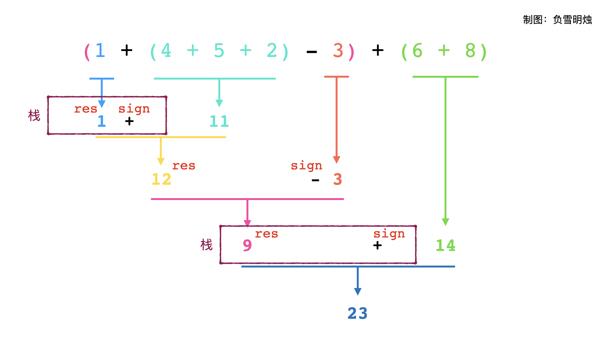

- [224. 基本计算器](#224-基本计算器)
- [232. 用栈实现队列](#232-用栈实现队列)

------------------------------

# 224. 基本计算器

实现一个基本的计算器来计算一个简单的字符串表达式 s 的值。

```
示例 1：

输入：s = "1 + 1"
输出：2

示例 2：

输入：s = " 2-1 + 2 "
输出：3

示例 3：

输入：s = "(1+(4+5+2)-3)+(6+8)"
输出：23
```

提示：

- 1 <= s.length <= $3 * 10^5$
- s 由数字、'+'、'-'、'('、')'、和 ' ' 组成
- s 表示一个有效的表达式

链接：https://leetcode-cn.com/problems/basic-calculator

**官方题解**

方法一：括号展开 + 栈

> 相当于把括号去掉了，然后改变了括号内的正负号。

由于字符串除了数字与括号外，只有加号和减号两种运算符。因此，如果展开表达式中所有的括号，则得到的新表达式中，数字本身不会发生变化，只是每个数字前面的符号会发生变化。

因此，我们考虑使用一个取值为 $\{-1,+1\}$ 的整数 $\textit{sign}$ 代表「当前」的符号。根据括号表达式的性质，它的取值：

- 与字符串中当前位置的运算符有关；
- 如果当前位置处于一系列括号之内，则也与这些括号前面的运算符有关：每当遇到一个以 $-$ 号开头的括号，则意味着此后的符号都要被「翻转」。

考虑到第二点，我们需要维护一个栈 $\textit{ops}$，其中栈顶元素记录了当前位置所处的每个括号所「共同形成」的符号。例如，对于字符串 $\text{1+2+(3-(4+5))}$：

- 扫描到 $\text{1+2}$ 时，由于当前位置没有被任何括号所包含，则栈顶元素为初始值 $+1$；
- 扫描到 $\text{1+2+(3}$ 时，当前位置被一个括号所包含，该括号前面的符号为 $+$ 号，因此栈顶元素依然 $+1$；
- 扫描到 $\text{1+2+(3-(4}$ 时，当前位置被两个括号所包含，分别对应着 $+$ 号和 $-$ 号，由于 $+$ 号和 $-$ 号合并的结果为 $-$ 号，因此栈顶元素变为 $-1$。

在得到栈 $\textit{ops}$ 之后， $\textit{sign}$ 的取值就能够确定了：如果当前遇到了 $+$ 号，则更新 $\textit{sign} \leftarrow \text{ops.top()}$；如果遇到了遇到了 $-$ 号，则更新 $\textit{sign} \leftarrow -\text{ops.top()}$。

然后，每当遇到 $($ 时，都要将当前的 $\textit{sign}$ 取值压入栈中；每当遇到 $)$ 时，都从栈中弹出一个元素。这样，我们能够在扫描字符串的时候，即时地更新 $\textit{ops}$ 中的元素。

```go
func calculate(s string) (ans int) {
    ops := []int{1}
    sign := 1
    n := len(s)
    for i := 0; i < n; {
        switch s[i] {
        case ' ':
            i++
        case '+':
            sign = ops[len(ops)-1]
            i++
        case '-':
            // 如果前面已经是 - 了，那这里就会变成 +。
            sign = -ops[len(ops)-1]
            i++
        case '(':
            ops = append(ops, sign)
            i++
        case ')':
            ops = ops[:len(ops)-1]
            i++
        default:
            num := 0
            for ; i < n && '0' <= s[i] && s[i] <= '9'; i++ {
                num = num*10 + int(s[i]-'0')
            }
            ans += sign * num
        }
    }
    return
}
```

复杂度分析

- 时间复杂度：$O(n)$，其中 $n$ 为字符串 $s$ 的长度。需要遍历字符串 $s$ 一次，计算表达式的值。
- 空间复杂度：$O(n)$，其中 $n$ 为字符串 $s$ 的长度。空间复杂度主要取决于栈的空间，栈中的元素数量不超过 $n$。

备注

本题有多种基于栈这一数据结构的解法，每种解法基于相近的思路，但具有完全不同的实现方式。感兴趣的读者可以尝试阅读其他基于栈的解法，本题解不再一一列举。

链接：https://leetcode-cn.com/problems/basic-calculator/solution/ji-ben-ji-suan-qi-by-leetcode-solution-jvir/

--------------------



> [链接](https://leetcode-cn.com/problems/basic-calculator/solution/ru-he-xiang-dao-yong-zhan-si-lu-lai-zi-y-gpca/)
>
> 这种比较符合直觉。没有改变括号内的正负号，而是在遇到括号时把前面的 res 和 sign 压栈，计算完括号后再弹出来。
> 
> 官方的题解是只把符号压栈了。

```py
class Solution(object):
    def calculate(self, s):
        res, num, sign = 0, 0, 1
        stack = []
        for c in s:
            if c.isdigit():
                num = 10 * num + int(c)
            elif c == "+" or c == "-":
                res += sign * num
                num = 0
                sign = 1 if c == "+" else -1
            elif c == "(":
                stack.append(res)
                stack.append(sign)
                res = 0
                sign = 1
            elif c == ")":
                res += sign * num
                num = 0
                res *= stack.pop()
                res += stack.pop()
        res += sign * num
        return res
```


# 232. 用栈实现队列

请你仅使用两个栈实现先入先出队列。队列应当支持一般队列的支持的所有操作（push、pop、peek、empty）：

实现 MyQueue 类：

- `void push(int x)` 将元素 x 推到队列的末尾
- `int pop()` 从队列的开头移除并返回元素
- `int peek()` 返回队列开头的元素
- `boolean empty()` 如果队列为空，返回 true ；否则，返回 false

说明：

- 你只能使用标准的栈操作 —— 也就是只有 push to top, peek/pop from top, size, 和 is empty 操作是合法的。
- 你所使用的语言也许不支持栈。你可以使用 list 或者 deque（双端队列）来模拟一个栈，只要是标准的栈操作即可。

进阶：

- 你能否实现每个操作均摊时间复杂度为 $O(1)$ 的队列？换句话说，执行 n 个操作的总时间复杂度为 $O(n)$，即使其中一个操作可能花费较长时间。

示例：

```
输入：
["MyQueue", "push", "push", "peek", "pop", "empty"]
[[], [1], [2], [], [], []]
输出：
[null, null, null, 1, 1, false]

解释：
MyQueue myQueue = new MyQueue();
myQueue.push(1); // queue is: [1]
myQueue.push(2); // queue is: [1, 2] (leftmost is front of the queue)
myQueue.peek(); // return 1
myQueue.pop(); // return 1, queue is [2]
myQueue.empty(); // return false
```

提示：

- 1 <= x <= 9
- 最多调用 100 次 push、pop、peek 和 empty
- 假设所有操作都是有效的 （例如，一个空的队列不会调用 pop 或者 peek 操作）

链接：https://leetcode-cn.com/problems/implement-queue-using-stacks

> 官方题解太简单了，这里是摘抄的[这个题解](https://leetcode-cn.com/problems/implement-queue-using-stacks/solution/yong-zhan-shi-xian-dui-lie-by-leetcode/)的

方法1：入队$O(n)$，出队$O(1)$


入队时：
1. 把 S1 倒到 S2。
2. 把 3 入栈。
3. 把 S2 的再倒回来。
4. 最后 S1 中的元素和入栈时的顺序正好相反。


出队时就简单了，直接从 S1 顶部弹出就行了。

方法2：入队$O(1)$, 出队$O(n)$


入队时直接压入 S1。


> 这个图应该是弄错了。

出队时：
1. 把 S1 的元素都导到 S2，这样 S2 的顶部就是最开始的那个元素。
2. 从 S2 的顶部把最开始的元素弹出。

整体复杂度是 $O(1)$，每个元素入栈两次（S1 和 S2 各一次），每个元素都出栈两次（S1 出一次，S2 出一次）。
