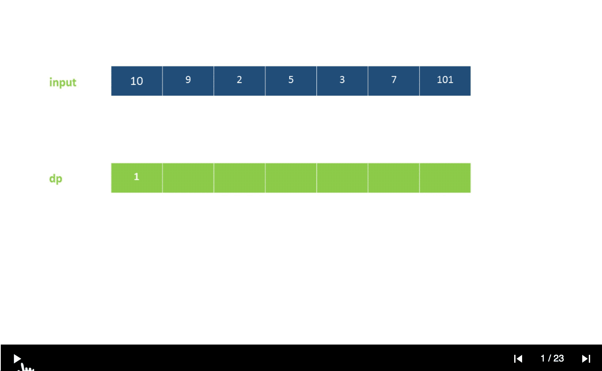
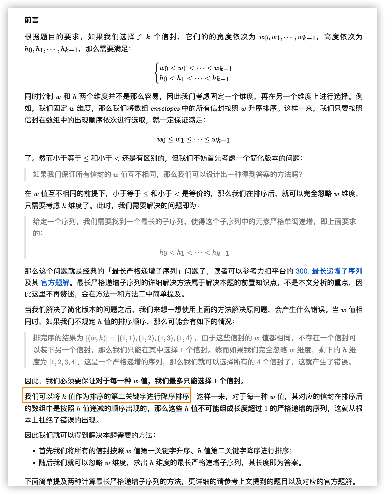

- [300. 最长递增子序列](#300-最长递增子序列)
- [303. 区域和检索 - 数组不可变](#303-区域和检索---数组不可变)
- [304. 二维区域和检索 - 矩阵不可变](#304-二维区域和检索---矩阵不可变)
- [338. 比特位计数](#338-比特位计数)
- [354. 俄罗斯套娃信封问题](#354-俄罗斯套娃信封问题)
- [385. 迷你语法分析器](#385-迷你语法分析器)

------------------------------

# 300. 最长递增子序列

给你一个整数数组 nums ，找到其中最长严格递增子序列的长度。

子序列是由数组派生而来的序列，删除（或不删除）数组中的元素而不改变其余元素的顺序。例如，`[3,6,2,7]` 是数组 `[0,3,1,6,2,2,7]` 的子序列。
 

示例 1：

```
输入：nums = [10,9,2,5,3,7,101,18]
输出：4
解释：最长递增子序列是 [2,3,7,101]，因此长度为 4 。
```

示例 2：

```
输入：nums = [0,1,0,3,2,3]
输出：4
```

示例 3：

```
输入：nums = [7,7,7,7,7,7,7]
输出：1
```

提示：

- 1 <= nums.length <= 2500
- $-10^4$ <= `nums[i]` <= $10^4$

进阶：

- 你可以设计时间复杂度为 $O(n^2)$ 的解决方案吗？
- 你能将算法的时间复杂度降低到 $O(n log(n))$ 吗?

链接：https://leetcode-cn.com/problems/longest-increasing-subsequence

**官方题解**

方法一：动态规划

思路与算法

定义 $\textit{dp}[i]$ 为考虑前 $i$ 个元素，以第 $i$ 个数字结尾的最长上升子序列的长度，注意 $\textit{nums}[i]$ 必须被选取。

我们从小到大计算 $\textit{dp}$ 数组的值，在计算 $\textit{dp}[i]$ 之前，我们已经计算出 $\textit{dp}[0 \ldots i-1]$ 的值，则状态转移方程为：

$$
\textit{dp}[i] = \max(\textit{dp}[j]) + 1, \text{其中} \, 0 \leq j < i \, \text{且} \, \textit{num}[j]<\textit{num}[i]
$$

即考虑往 $\textit{dp}[0 \ldots i-1]$ 中最长的上升子序列后面再加一个 $\textit{nums}[i]$。由于 $\textit{dp}[j]$ 代表 $\textit{nums}[0 \ldots j]$ 中以 $\textit{nums}[j]$ 结尾的最长上升子序列，所以如果能从 $\textit{dp}[j]$ 这个状态转移过来，那么 $\textit{nums}[i]$ 必然要大于 $\textit{nums}[j]$，才能将 $\textit{nums}[i]$ 放在 $\textit{nums}[j]$ 后面以形成更长的上升子序列。

最后，整个数组的最长上升子序列即所有 $\textit{dp}[i]$ 中的最大值。

$$
\text{LIS}_{\textit{length}}= \max(\textit{dp}[i]), \text{其中} \, 0\leq i < n
$$



```java
class Solution {
    public int lengthOfLIS(int[] nums) {
        if (nums.length == 0) {
            return 0;
        }
        int[] dp = new int[nums.length];
        dp[0] = 1;
        int maxans = 1;
        for (int i = 1; i < nums.length; i++) {
            dp[i] = 1;
            for (int j = 0; j < i; j++) {
                if (nums[i] > nums[j]) {
                    dp[i] = Math.max(dp[i], dp[j] + 1);
                }
            }
            maxans = Math.max(maxans, dp[i]);
        }
        return maxans;
    }
}
```

复杂度分析

- 时间复杂度：$O(n^2)$，其中 $n$ 为数组 $\textit{nums}$ 的长度。动态规划的状态数为 $n$，计算状态 $dp[i]$ 时，需要 $O(n)$ 的时间遍历 $dp[0 \ldots i-1]$ 的所有状态，所以总时间复杂度为 $O(n^2)$。
- 空间复杂度：$O(n)$，需要额外使用长度为 $n$ 的 $dp$ 数组。

--------------------

方法二：贪心 + 二分查找

思路与算法

考虑一个简单的贪心，如果我们要使上升子序列尽可能的长，则我们需要让序列上升得尽可能慢，因此我们希望每次在上升子序列最后加上的那个数尽可能的小。

基于上面的贪心思路，我们维护一个数组 $d[i]$ ，表示长度为 $i$ 的最长上升子序列的末尾元素的最小值，用 $\textit{len}$ 记录目前最长上升子序列的长度，起始时 $len$ 为 $1$，$d[1] = \textit{nums}[0]$。

同时我们可以注意到 $d[i]$ 是关于 $i$ 单调递增的。因为如果 $d[j] \geq d[i]$ 且 $j < i$，我们考虑从长度为 $i$ 的最长上升子序列的末尾删除 $i-j$ 个元素，那么这个序列长度变为 $j$ ，且第 $j$ 个元素 $x$（末尾元素）必然小于 $d[i]$，也就小于 $d[j]$。那么我们就找到了一个长度为 $j$ 的最长上升子序列，并且末尾元素比 $d[j]$ 小，从而产生了矛盾。因此数组 $d$ 的单调性得证。

> 我觉得这个题解的证明比较好理解。
> [链接](https://leetcode-cn.com/problems/longest-increasing-subsequence/solution/dong-tai-gui-hua-er-fen-cha-zhao-tan-xin-suan-fa-p/)
> 
> 证明：即对于任意的下标 `0 <= i < j < len`，都有 `tail[i] < tail[j]`。
> 
> 使用反证法：假设对于任意的下标 `i < j`，存在某个 `tail[i] >= tail[j]`。
> 
> 对于此处的 `tail[i]` 而言，对应一个上升子序列 $[a_0, a_1, ..., a_i]$，依据定义 $tail[i] = a_i$​；
> 
> 对于此处的 `tail[j]` 而言，对应一个上升子序列 $[b_0, b_1, ..., b_i, ... , b_j]$，依据定义 $tail[j] = b_j$​；
> 
> 由于 `tail[i] >= tail[j]`，等价于 $a_i \ge b_j$​。而在上升子序列 $[b_0, b_1, ..., b_i, ... , b_j]$ 中，$b_i$​ 严格小于 $b_j$​，故有 $a_i \ge b_j > b_i$​，则上升子序列 $[b_0, b_1, ..., b_i]$ 是一个长度也为 $i + 1$ 但是结尾更小的数组，与 $a_i$​ 的最小性矛盾。
> 
> 因此原命题成立。（证完）


我们依次遍历数组 $\textit{nums}$ 中的每个元素，并更新数组 $d$ 和 $len$ 的值。如果 $\textit{nums}[i] > d[\textit{len}]$ 则更新 $len = len + 1$，否则在 $d[1 \ldots len]$ 中找满足 $d[i - 1] < \textit{nums}[j] < d[i]$ 的下标 $i$，并更新 $d[i] = \textit{nums}[j]$。

根据 $d$ 数组的单调性，我们可以使用二分查找寻找下标 $i$，优化时间复杂度。

最后整个算法流程为：

设当前已求出的最长上升子序列的长度为 $\textit{len}$（初始时为 $1$），从前往后遍历数组 $\textit{nums}$，在遍历到 $\textit{nums}[i]$ 时：

- 如果 $\textit{nums}[i] > d[\textit{len}]$ ，则直接加入到 $d$ 数组末尾，并更新 $\textit{len} = \textit{len} + 1$；
- 否则，在 $d$ 数组中二分查找，找到第一个比 $\textit{nums}[i]$ 小的数 $d[k]$ ，并更新 $d[k + 1] = \textit{nums}[i]$。

以输入序列 $[0, 8, 4, 12, 2]$ 为例：

- 第一步插入 $0$，$d = [0]$；
- 第二步插入 $8$，$d = [0, 8]$；
- 第三步插入 $4$，$d = [0, 4]$；
- 第四步插入 $12$，$d = [0, 4, 12]$；
- 第五步插入 $2$，$d = [0, 2, 12]$。

最终得到最大递增子序列长度为 $3$。

```java
class Solution {
    public int lengthOfLIS(int[] nums) {
        int len = 1, n = nums.length;
        if (n == 0) {
            return 0;
        }
        int[] d = new int[n + 1];
        d[len] = nums[0];
        for (int i = 1; i < n; ++i) {
            if (nums[i] > d[len]) {
                d[++len] = nums[i];
            } else {
                int l = 1, r = len, pos = 0; // 如果找不到说明所有的数都比 nums[i] 大，此时要更新 d[1]，所以这里将 pos 设为 0
                while (l <= r) {
                    int mid = (l + r) >> 1;
                    if (d[mid] < nums[i]) {
                        pos = mid;
                        l = mid + 1;
                    } else {
                        r = mid - 1;
                    }
                }
                d[pos + 1] = nums[i];
            }
        }
        return len;
    }
}
```

复杂度分析

- 时间复杂度：$O(n\log n)$。数组 $\textit{nums}$ 的长度为 $n$，我们依次用数组中的元素去更新 $d$ 数组，而更新 $d$ 数组时需要进行 $O(\log n)$ 二分搜索，所以总时间复杂度为 $O(n\log n)$。
- 空间复杂度：$O(n)$，需要额外使用长度为 $n$ 的 $d$ 数组。


# 303. 区域和检索 - 数组不可变

给定一个整数数组  nums，求出数组从索引 i 到 j（i ≤ j）范围内元素的总和，包含 i、j 两点。

实现 NumArray 类：

- `NumArray(int[] nums)` 使用数组 nums 初始化对象
- `int sumRange(int i, int j)` 返回数组 nums 从索引 i 到 j（i ≤ j）范围内元素的总和，包含 i、j 两点（也就是 sum(`nums[i]`, `nums[i + 1]`, ... , `nums[j]`)）

示例：

```
输入：
["NumArray", "sumRange", "sumRange", "sumRange"]
[[[-2, 0, 3, -5, 2, -1]], [0, 2], [2, 5], [0, 5]]
输出：
[null, 1, -1, -3]

解释：
NumArray numArray = new NumArray([-2, 0, 3, -5, 2, -1]);
numArray.sumRange(0, 2); // return 1 ((-2) + 0 + 3)
numArray.sumRange(2, 5); // return -1 (3 + (-5) + 2 + (-1)) 
numArray.sumRange(0, 5); // return -3 ((-2) + 0 + 3 + (-5) + 2 + (-1))
```

提示：

- 0 <= nums.length <= 104
- -105 <= `nums[i]` <= 105
- 0 <= i <= j < nums.length
- 最多调用 104 次 sumRange 方法

链接：https://leetcode-cn.com/problems/range-sum-query-immutable

**官方题解**


```go
type NumArray struct {
    sums []int
}

func Constructor(nums []int) NumArray {
    sums := make([]int, len(nums)+1)
    for i, v := range nums {
        sums[i+1] = sums[i] + v
    }
    return NumArray{sums}
}

func (na *NumArray) SumRange(i, j int) int {
    return na.sums[j+1] - na.sums[i]
}
```

链接：https://leetcode-cn.com/problems/range-sum-query-immutable/solution/qu-yu-he-jian-suo-shu-zu-bu-ke-bian-by-l-px41/


# 304. 二维区域和检索 - 矩阵不可变

给定一个二维矩阵，计算其子矩形范围内元素的总和，该子矩阵的左上角为 (row1, col1) ，右下角为 (row2, col2) 。


上图子矩阵左上角 (row1, col1) = (2, 1) ，右下角(row2, col2) = (4, 3)，该子矩形内元素的总和为 8。

示例：

```
给定 matrix = [
  [3, 0, 1, 4, 2],
  [5, 6, 3, 2, 1],
  [1, 2, 0, 1, 5],
  [4, 1, 0, 1, 7],
  [1, 0, 3, 0, 5]
]

sumRegion(2, 1, 4, 3) -> 8
sumRegion(1, 1, 2, 2) -> 11
sumRegion(1, 2, 2, 4) -> 12
```

提示：

- 你可以假设矩阵不可变。
- 会多次调用 sumRegion 方法。
- 你可以假设 row1 ≤ row2 且 col1 ≤ col2 。

链接：https://leetcode-cn.com/problems/range-sum-query-2d-immutable

**官方题解**

前言

这道题是「303. 区域和检索 - 数组不可变」的进阶，第 303 题是在一维数组中做区域和检索，这道题是在二维矩阵中做区域和检索。

这道题有两种解法，分别是对每一行计算一维前缀和，以及对整个矩阵计算二维前缀和。

方法一：一维前缀和

第 303 题中，初始化时对数组计算前缀和，每次检索即可在 $O(1)$ 的时间内得到结果。可以将第 303 题的做法应用于这道题，初始化时对矩阵的每一行计算前缀和，检索时对二维区域中的每一行计算子数组和，然后对每一行的子数组和计算总和。

具体实现方面，创建 m 行 n+1 列的二维数组 sums，其中 m 和 n 分别是矩阵 matrix 的行数和列数，$\textit{sums}[i]$ 为 $\textit{matrix}[i]$ 的前缀和数组。将 sums 的列数设为 n+1 的目的是为了方便计算每一行的子数组和，不需要对 $\textit{col}_1=0$ 的情况特殊处理。

```go
type NumMatrix struct {
    sums [][]int
}

func Constructor(matrix [][]int) NumMatrix {
    sums := make([][]int, len(matrix))
    for i, row := range matrix {
        sums[i] = make([]int, len(row)+1)
        for j, v := range row {
            sums[i][j+1] = sums[i][j] + v
        }
    }
    return NumMatrix{sums}
}

func (nm *NumMatrix) SumRegion(row1, col1, row2, col2 int) (sum int) {
    for i := row1; i <= row2; i++ {
        sum += nm.sums[i][col2+1] - nm.sums[i][col1]
    }
    return
}
```

复杂度分析

- 时间复杂度：初始化 $O(mn)$，每次检索 $O(m)$，其中 m 和 n 分别是矩阵 matrix 的行数和列数。

    初始化需要遍历矩阵 matrix 计算二维前缀和，时间复杂度是 $O(mn)$。
    每次检索需要对二维区域中的每一行计算子数组和，二维区域的行数不超过 m，计算每一行的子数组和的时间复杂度是 $O(1)$，因此每次检索的时间复杂度是 $O(m)$。

- 空间复杂度：$O(mn)$，其中 m 和 n 分别是矩阵 matrix 的行数和列数。需要创建一个 m 行 n+1 列的前缀和数组 sums。


```go
type NumMatrix struct {
    sums [][]int
}

func Constructor(matrix [][]int) NumMatrix {
    m := len(matrix)
    if m == 0 {
        return NumMatrix{}
    }
    n := len(matrix[0])
    sums := make([][]int, m+1)
    sums[0] = make([]int, n+1)
    for i, row := range matrix {
        sums[i+1] = make([]int, n+1)
        for j, v := range row {
            // 上边 + 左边 - 左上 + 当前元素
            sums[i+1][j+1] = sums[i+1][j] + sums[i][j+1] - sums[i][j] + v
        }
    }
    return NumMatrix{sums}
}

func (nm *NumMatrix) SumRegion(row1, col1, row2, col2 int) int {
    return nm.sums[row2+1][col2+1] - nm.sums[row1][col2+1] - nm.sums[row2+1][col1] + nm.sums[row1][col1]
}
```

复杂度分析

- 时间复杂度：初始化 $O(mn)$，每次检索 $O(1)$，其中 m 和 n 分别是矩阵 matrix 的行数和列数。

    初始化需要遍历矩阵 matrix 计算二维前缀和，时间复杂度是 $O(mn)$。
    每次检索的时间复杂度是 $O(1)$。

- 空间复杂度：$O(mn)$，其中 m 和 n 分别是矩阵 matrix 的行数和列数。需要创建一个 m+1 行 n+1 列的二维前缀和数组 sums。

链接：https://leetcode-cn.com/problems/range-sum-query-2d-immutable/solution/er-wei-qu-yu-he-jian-suo-ju-zhen-bu-ke-b-2z5n/


# 338. 比特位计数

给定一个非负整数 num。对于 0 ≤ i ≤ num 范围中的每个数字 i ，计算其二进制数中的 1 的数目并将它们作为数组返回。

示例 1:

```
输入: 2
输出: [0,1,1]
```

示例 2:

```
输入: 5
输出: [0,1,1,2,1,2]
```

进阶:

- 给出时间复杂度为 $O(n*sizeof(integer))$ 的解答非常容易。但你可以在线性时间 $O(n)$ 内用一趟扫描做到吗？
- 要求算法的空间复杂度为 $O(n)$。
- 你能进一步完善解法吗？要求在C++或任何其他语言中不使用任何内置函数（如 C++ 中的 `__builtin_popcount`）来执行此操作。

链接：https://leetcode-cn.com/problems/counting-bits


**官方题解**

前言

这道题需要计算从 0 到 num 的每个数的二进制表示中的 1 的数目。最直观的方法是对每个数直接计算二进制表示中的 1 的数目，时间复杂度较高。也可以使用动态规划的方法，时间复杂度较低。

为了表述简洁，下文用「一比特数」表示二进制表示中的 1 的数目。

方法一：直接计算

最直观的方法是对从 0 到 num 的每个数直接计算「一比特数」。

每个 int 型的数都可以用 32 位二进制数表示，只要遍历其二进制表示的每一位即可得到 1 的数目。

利用位运算的技巧，可以在一定程度上提升计算速度。按位与运算（&）的一个性质是：对于任意整数 x，令 `x=x&(x−1)`，该运算将 x 的二进制表示的最后一个 1 变成 0。因此，对 x 重复该操作，直到 x 变成 0，则操作次数即为 x 的「一比特数」。

另外，部分编程语言有相应的内置函数，例如 Java 的 `Integer.bitCount`，C++ 的 `__builtin_popcount`，Go 的 `bits.OnesCount` 等，读者可以自行尝试。需要注意的是，使用编程语言的内置函数时，不适用本方法的时间复杂度分析。

```go
func onesCount(x int) (ones int) {
    for ; x > 0; x &= x - 1 {
        ones++
    }
    return
}

func countBits(num int) []int {
    bits := make([]int, num+1)
    for i := range bits {
        bits[i] = onesCount(i)
    }
    return bits
}
```

复杂度分析

- 时间复杂度：$O(k \times \textit{num})$，其中 k 是 int 型的二进制位数，k=32。需要对从 0 到 num 的每个数使用 $O(k)$ 的时间计算「一比特数」，因此时间复杂度是 $O(k \times \textit{num})$。
- 空间复杂度：$O(1)$。除了返回的数组以外，空间复杂度为常数。

--------------------

方法二：动态规划——最高有效位

方法一需要对每个数遍历其二进制表示的每一位。可以换一个思路，当计算 i 的「一比特数」时，如果存在 $0 \le j<i$，j 的「一比特数」已知，且 i 和 j 相比，i 的二进制表示只多了一个 1，则可以快速得到 i 的「一比特数」。

令 `bits[i]` 表示 i 的「一比特数」，则上述关系可以表示成：`bits[i]=bits[j]+1`。

对于正整数 x，如果可以知道最大的正整数 y，使得 $y \le x$ 且 y 是 2 的整数次幂，则 y 的二进制表示中只有最高位是 1，其余都是 0，此时称 y 为 x 的「最高有效位」。令 `z=x−y`，显然 $0 \le z<x$，则 `bits[x]=bits[z]+1`。(就是从 x 中把最高的 1 去掉后)

为了判断一个正整数是不是 2 的整数次幂，可以利用方法一中提到的按位与运算的性质。如果正整数 y 是 2 的整数次幂，则 y 的二进制表示中只有最高位是 1，其余都是 0，因此 `y&(y−1)=0`。由此可见，正整数 y 是 2 的整数次幂，当且仅当 `y&(y−1)=0`。

显然，0 的「一比特数」为 0。使用 highBit 表示当前的最高有效位，遍历从 1 到 num 的每个正整数 i，进行如下操作。

- 如果 `i&(i−1)=0`，则令 `highBit=i`，更新当前的最高有效位。
- i 比 i−highBit 的「一比特数」多 1，由于是从小到大遍历每个数，因此遍历到 i 时，i−highBit 的「一比特数」已知，令 `bits[i]=bits[i−highBit]+1`。

最终得到的数组 bits 即为答案。

```go
func countBits(num int) []int {
    bits := make([]int, num+1)
    highBit := 0
    for i := 1; i <= num; i++ {
        if i&(i-1) == 0 {
            highBit = i
        }
        bits[i] = bits[i-highBit] + 1
    }
    return bits
}
```

复杂度分析

- 时间复杂度：$O(\textit{num})$。对于每个数，只需要 $O(1)$ 的时间计算「一比特数」。
- 空间复杂度：$O(1)$。除了返回的数组以外，空间复杂度为常数。

--------------------

方法三：动态规划——最低有效位

方法二需要实时维护最高有效位，当遍历到的数是 2 的整数次幂时，需要更新最高有效位。如果再换一个思路，可以使用「最低有效位」计算「一比特数」。

对于正整数 x，将其二进制表示右移一位，等价于将其二进制表示的最低位去掉，得到的数是 $\lfloor \frac{x}{2} \rfloor$。如果 $\textit{bits}\big[\lfloor \frac{x}{2} \rfloor\big]$ 的值已知，则可以得到 $\textit{bits}[x]$ 的值：

- 如果 x 是偶数，则 $\textit{bits}[x]=\textit{bits}\big[\lfloor \frac{x}{2} \rfloor\big]$；
- 如果 x 是奇数，则 $\textit{bits}[x]=\textit{bits}\big[\lfloor \frac{x}{2} \rfloor\big]+1$。

上述两种情况可以合并成：$\textit{bits}[x]$ 的值等于 $\textit{bits}\big[\lfloor \frac{x}{2} \rfloor\big]$ 的值加上 x 除以 2 的余数。

由于 $\lfloor \frac{x}{2} \rfloor$ 可以通过 $x >> 1$ 得到，x 除以 2 的余数可以通过 $x \& 1$ 得到，因此有：$\textit{bits}[x]=\textit{bits}[x>>1]+(x \& 1)$。

遍历从 1 到 num 的每个正整数 i，计算 bits 的值。最终得到的数组 bits 即为答案。

```go
func countBits(num int) []int {
    bits := make([]int, num+1)
    for i := 1; i <= num; i++ {
        bits[i] = bits[i>>1] + i&1
    }
    return bits
}
```

复杂度分析

- 时间复杂度：$O(\textit{num})$。对于每个数，只需要 $O(1)$ 的时间计算「一比特数」。
- 空间复杂度：$O(1)$。除了返回的数组以外，空间复杂度为常数。

--------------------

方法四：动态规划——最低设置位

定义正整数 x 的「最低设置位」为 x 的二进制表示中的最低的 1 所在位。例如，10 的二进制表示是 $1010_{(2)}$​，其最低设置位为 2，对应的二进制表示是 $10_{(2)}$。

令 $y=x \&(x-1)$，则 y 为将 x 的最低设置位从 1 变成 0 之后的数，显然 $0 \le y<x$，`bits[x]=bits[y]+1`。因此对任意正整数 x，都有 `bits[x]=bits[x&(x−1)]+1`。

遍历从 1 到 num 的每个正整数 i，计算 bits 的值。最终得到的数组 bits 即为答案。

```go
func countBits(num int) []int {
    bits := make([]int, num+1)
    for i := 1; i <= num; i++ {
        bits[i] = bits[i&(i-1)] + 1
    }
    return bits
}
```

复杂度分析

- 时间复杂度：$O(\textit{num})$。对于每个数，只需要 $O(1)$ 的时间计算「一比特数」。
- 空间复杂度：$O(1)$。除了返回的数组以外，空间复杂度为常数。

链接：https://leetcode-cn.com/problems/counting-bits/solution/bi-te-wei-ji-shu-by-leetcode-solution-0t1i/

--------------------

> 下面这个题解对应的是上面的方法三。

对于所有的数字，只有两类：

奇数：二进制表示中，奇数一定比前面那个偶数多一个 1，因为多的就是最低位的 1。

```
0 = 0       1 = 1
2 = 10      3 = 11
```

偶数：二进制表示中，偶数中 1 的个数一定和除以 2 之后的那个数一样多。因为最低位是 0，除以 2 就是右移一位，也就是把那个 0 抹掉而已，所以 1 的个数是不变的。

```
2 = 10       4 = 100       8 = 1000
3 = 11       6 = 110       12 = 1100
```

另外，0 的 1 个数为 0，于是就可以根据奇偶性开始遍历计算了。

```c++
vector<int> countBits(int num) {
    vector<int> result(num+1);
    result[0] = 0;
    for(int i = 1; i <= num; i++)
    {
        if(i % 2 == 1)
        {
            result[i] = result[i-1] + 1;
        }
        else
        {
            result[i] = result[i/2];
        }
    }
    
    return result;
}
```

链接：https://leetcode-cn.com/problems/counting-bits/solution/hen-qing-xi-de-si-lu-by-duadua/


# 354. 俄罗斯套娃信封问题

给定一些标记了宽度和高度的信封，宽度和高度以整数对形式 (w, h) 出现。当另一个信封的宽度和高度都比这个信封大的时候，这个信封就可以放进另一个信封里，如同俄罗斯套娃一样。

请计算最多能有多少个信封能组成一组“俄罗斯套娃”信封（即可以把一个信封放到另一个信封里面）。

说明: 不允许旋转信封。

示例:

```
输入: envelopes = [[5,4],[6,4],[6,7],[2,3]]
输出: 3 
解释: 最多信封的个数为 3, 组合为: [2,3] => [5,4] => [6,7]。
```

链接：https://leetcode-cn.com/problems/russian-doll-envelopes


**官方题解**



> 难点就在于对 h 进行降序。

方法一：动态规划

思路与算法

设 $f[i]$ 表示 $h$ 的前 $i$ 个元素可以组成的最长严格递增子序列的长度，并且我们必须选择第 $i$ 个元素 $h_i$​。在进行状态转移时，我们可以考虑倒数第二个选择的元素 $h_j$​，必须满足 $h_j < h_i$​ 且 $j < i$，因此可以写出状态转移方程：

$$
f[i] = \max_{j<i ~\wedge~ h_j<h_i } \{ f[j] \} + 1
$$

如果不存在比 $h_i$​ 小的元素 $h_j$​，那么 $f[i]$ 的值为 $1$，即只选择了唯一的第 $i$ 个元素。

在计算完所有的 $f$ 值之后，其中的最大值即为最长严格递增子序列的长度。

代码

由于方法一的时间复杂度较高，一些语言对应的代码可能会超出时间限制。

```go
func maxEnvelopes(envelopes [][]int) int {
    n := len(envelopes)
    if n == 0 {
        return 0
    }

    sort.Slice(envelopes, func(i, j int) bool {
        a, b := envelopes[i], envelopes[j]
        return a[0] < b[0] || a[0] == b[0] && a[1] > b[1]
    })

    f := make([]int, n)
    for i := range f {
        f[i] = 1
    }
    for i := 1; i < n; i++ {
        for j := 0; j < i; j++ {
            if envelopes[j][1] < envelopes[i][1] {
                f[i] = max(f[i], f[j]+1)
            }
        }
    }
    return max(f...)
}

func max(a ...int) int {
    res := a[0]
    for _, v := range a[1:] {
        if v > res {
            res = v
        }
    }
    return res
}
```


复杂度分析

- 时间复杂度：$O(n^2)$，其中 $n$ 是数组 $\textit{envelopes}$ 的长度，排序需要的时间复杂度为 $O(n \log n)$，动态规划需要的时间复杂度为 $O(n^2)$，前者在渐近意义下小于后者，可以忽略。
- 空间复杂度：$O(n)$，即为数组 $f$ 需要的空间。

--------------------

方法二：基于二分查找的动态规划

思路与算法

设 $f[j]$ 表示 $h$ 的前 $i$ 个元素可以组成的长度为 $j$ 的最长严格递增子序列的末尾元素的最小值，如果不存在长度为 $j$ 的最长严格递增子序列，对应的 $f$ 值无定义。在定义范围内，可以看出 $f$ 值是严格单调递增的，因为越长的子序列的末尾元素显然越大。

在进行状态转移时，我们考虑当前的元素 $h_i$​：

- 如果 $h_i$​ 大于 $f$ 中的最大值，那么 $h_i$​ 就可以接在 $f$ 中的最大值之后，形成一个长度更长的严格递增子序列；
- 否则我们找出 $f$ 中比 $h_i$​ 严格小的最大的元素 $f[j_0]$，即 $f[j_0] < h_i \leq f[j_0+1]$，那么 $h_i$​ 可以接在 $f[j_0]$ 之后，形成一个长度为 $j_0+1$ 的严格递增子序列，因此需要对 $f[j_0+1]$ 进行更新：

    $$
    f[j_0+1] = h_i
    $$

    我们可以在 $f$ 上进行二分查找，找出满足要求的 $j_0$​。

在遍历所有的 $h_i$​ 之后，$f$ 中最后一个有定义的元素的下标增加 $1$（下标从 $0$ 开始）即为最长严格递增子序列的长度。

```go
func maxEnvelopes(envelopes [][]int) int {
    sort.Slice(envelopes, func(i, j int) bool {
        a, b := envelopes[i], envelopes[j]
        return a[0] < b[0] || a[0] == b[0] && a[1] > b[1]
    })

    f := []int{}
    for _, e := range envelopes {
        h := e[1]
        if i := sort.SearchInts(f, h); i < len(f) {
            f[i] = h
        } else {
            f = append(f, h)
        }
    }
    return len(f)
}
```


复杂度分析

- 时间复杂度：$O(n \log n)$，其中 $n$ 是数组 $\textit{envelopes}$ 的长度，排序需要的时间复杂度为 $O(n \log n)$，动态规划需要的时间复杂度同样为 $O(n \log n)$。
- 空间复杂度：$O(n)$，即为数组 $f$ 需要的空间。

链接：https://leetcode-cn.com/problems/russian-doll-envelopes/solution/e-luo-si-tao-wa-xin-feng-wen-ti-by-leetc-wj68/


# 385. 迷你语法分析器

给定一个字符串 s 表示一个整数嵌套列表，实现一个解析它的语法分析器并返回解析的结果 NestedInteger 。

列表中的每个元素只可能是整数或整数嵌套列表

示例 1：

```
输入：s = "324",
输出：324
解释：你应该返回一个 NestedInteger 对象，其中只包含整数值 324。
```

示例 2：

```
输入：s = "[123,[456,[789]]]",
输出：[123,[456,[789]]]
解释：返回一个 NestedInteger 对象包含一个有两个元素的嵌套列表：
1. 一个 integer 包含值 123
2. 一个包含两个元素的嵌套列表：
    i.  一个 integer 包含值 456
    ii. 一个包含一个元素的嵌套列表
         a. 一个 integer 包含值 789
```

提示：

- $1 <= s.length <= 5 * 10^4$
- s 由数字、方括号 "[]"、负号 '-' 、逗号 ','组成
- 用例保证 s 是可解析的 NestedInteger
- 输入中的所有值的范围是 $[-10^6, 10^6]$

链接：https://leetcode-cn.com/problems/mini-parser

> 第一次：可以直接用递归来做，如果递归没有通过，可以用栈来模拟递归。
> Rust 写的感觉有点啰嗦。

**官方题解**

一：深度优先搜索

根据题意，一个 NestedInteger 实例只能包含下列两部分之一：1）一个整数；2）一个列表，列表中的每个元素都是一个 NestedInteger 实例。据此，NestedInteger 是通过递归定义的，因此也可以用递归的方式来解析。

从左至右遍历 s，

如果第一位是 `[` 字符，则表示待解析的是一个列表，从 `[` 后面的字符开始又是一个新的 NestedInteger 实例，我们仍调用解析函数来解析列表的元素，调用结束后如果遇到的是 `,` 字符，表示列表仍有其他元素，需要继续调用。如果是 `]` 字符，表示这个列表已经解析完毕，可以返回 NestedInteger 实例。
否则，则表示待解析的 NestedInteger 只包含一个整数。我们可以从左至右解析这个整数，并注意是否是负数，直到遍历完或者遇到非数字字符（`]` 或 `,`），并返回 NestedInteger 实例。

```go
func deserialize(s string) *NestedInteger {
    index := 0
    var dfs func() *NestedInteger
    dfs = func() *NestedInteger {
        ni := &NestedInteger{}
        if s[index] == '[' {
            index++
            for s[index] != ']' {
                ni.Add(*dfs())
                if s[index] == ',' {
                    index++
                }
            }
            index++
            return ni
        }

        negative := s[index] == '-'
        if negative {
            index++
        }
        num := 0
        for ; index < len(s) && unicode.IsDigit(rune(s[index])); index++ {
            num = num*10 + int(s[index]-'0')
        }
        if negative {
            num = -num
        }
        ni.SetInteger(num)
        return ni
    }
    return dfs()
}
```

二：栈

上述递归的思路也可以用栈来模拟。从左至右遍历 s，如果遇到 `[`，则表示是一个新的 NestedInteger 实例，需要将其入栈。如果遇到 `]` 或 `,`，则表示是一个数字或者 NestedInteger 实例的结束，需要将其添加入栈顶的 NestedInteger 实例。最后需返回栈顶的实例。

```go
func deserialize(s string) *NestedInteger {
    if s[0] != '[' {
        num, _ := strconv.Atoi(s)
        ni := &NestedInteger{}
        ni.SetInteger(num)
        return ni
    }
    stack, num, negative := []*NestedInteger{}, 0, false
    for i, ch := range s {
        if ch == '-' {
            negative = true
        } else if unicode.IsDigit(ch) {
            num = num*10 + int(ch-'0')
        } else if ch == '[' {
            stack = append(stack, &NestedInteger{})
        } else if ch == ',' || ch == ']' {
            if unicode.IsDigit(rune(s[i-1])) {
                if negative {
                    num = -num
                }
                ni := NestedInteger{}
                ni.SetInteger(num)
                stack[len(stack)-1].Add(ni)
            }
            num, negative = 0, false
            if ch == ']' && len(stack) > 1 {
                stack[len(stack)-2].Add(*stack[len(stack)-1])
                stack = stack[:len(stack)-1]
            }
        }
    }
    return stack[len(stack)-1]
}
```

这两种方式的时间和空间复杂度都是 $O(n)$.

链接：https://leetcode-cn.com/problems/mini-parser/solution/mi-ni-yu-fa-fen-xi-qi-by-leetcode-soluti-l2ma/