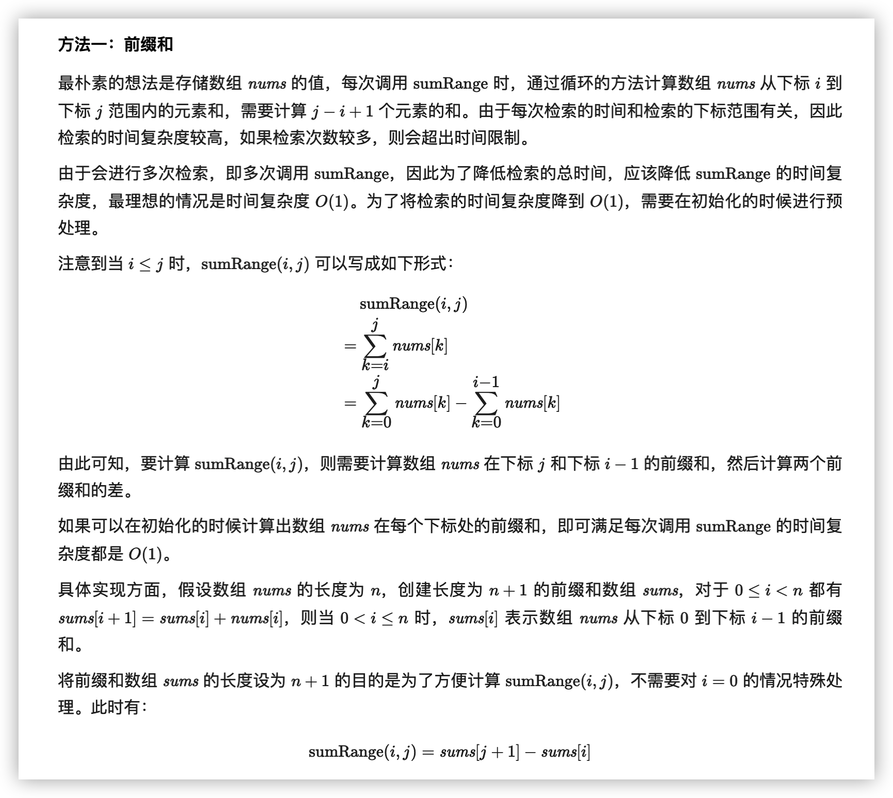
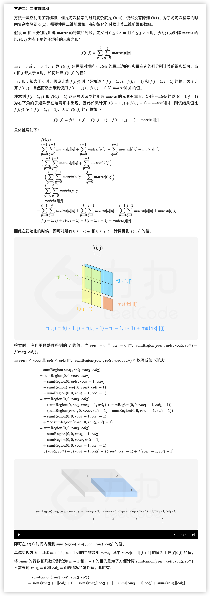

- [303. 区域和检索 - 数组不可变](#303-区域和检索---数组不可变)
- [304. 二维区域和检索 - 矩阵不可变](#304-二维区域和检索---矩阵不可变)

------------------------------

# 303. 区域和检索 - 数组不可变

给定一个整数数组  nums，求出数组从索引 i 到 j（i ≤ j）范围内元素的总和，包含 i、j 两点。

实现 NumArray 类：

- `NumArray(int[] nums)` 使用数组 nums 初始化对象
- `int sumRange(int i, int j)` 返回数组 nums 从索引 i 到 j（i ≤ j）范围内元素的总和，包含 i、j 两点（也就是 sum(`nums[i]`, `nums[i + 1]`, ... , `nums[j]`)）

示例：

```
输入：
["NumArray", "sumRange", "sumRange", "sumRange"]
[[[-2, 0, 3, -5, 2, -1]], [0, 2], [2, 5], [0, 5]]
输出：
[null, 1, -1, -3]

解释：
NumArray numArray = new NumArray([-2, 0, 3, -5, 2, -1]);
numArray.sumRange(0, 2); // return 1 ((-2) + 0 + 3)
numArray.sumRange(2, 5); // return -1 (3 + (-5) + 2 + (-1)) 
numArray.sumRange(0, 5); // return -3 ((-2) + 0 + 3 + (-5) + 2 + (-1))
```

提示：

- 0 <= nums.length <= 104
- -105 <= `nums[i]` <= 105
- 0 <= i <= j < nums.length
- 最多调用 104 次 sumRange 方法

链接：https://leetcode-cn.com/problems/range-sum-query-immutable

**官方题解**



```go
type NumArray struct {
    sums []int
}

func Constructor(nums []int) NumArray {
    sums := make([]int, len(nums)+1)
    for i, v := range nums {
        sums[i+1] = sums[i] + v
    }
    return NumArray{sums}
}

func (na *NumArray) SumRange(i, j int) int {
    return na.sums[j+1] - na.sums[i]
}
```

链接：https://leetcode-cn.com/problems/range-sum-query-immutable/solution/qu-yu-he-jian-suo-shu-zu-bu-ke-bian-by-l-px41/


# 304. 二维区域和检索 - 矩阵不可变

给定一个二维矩阵，计算其子矩形范围内元素的总和，该子矩阵的左上角为 (row1, col1) ，右下角为 (row2, col2) 。


上图子矩阵左上角 (row1, col1) = (2, 1) ，右下角(row2, col2) = (4, 3)，该子矩形内元素的总和为 8。

示例：

```
给定 matrix = [
  [3, 0, 1, 4, 2],
  [5, 6, 3, 2, 1],
  [1, 2, 0, 1, 5],
  [4, 1, 0, 1, 7],
  [1, 0, 3, 0, 5]
]

sumRegion(2, 1, 4, 3) -> 8
sumRegion(1, 1, 2, 2) -> 11
sumRegion(1, 2, 2, 4) -> 12
```

提示：

- 你可以假设矩阵不可变。
- 会多次调用 sumRegion 方法。
- 你可以假设 row1 ≤ row2 且 col1 ≤ col2 。

链接：https://leetcode-cn.com/problems/range-sum-query-2d-immutable

**官方题解**

前言

这道题是「303. 区域和检索 - 数组不可变」的进阶，第 303 题是在一维数组中做区域和检索，这道题是在二维矩阵中做区域和检索。

这道题有两种解法，分别是对每一行计算一维前缀和，以及对整个矩阵计算二维前缀和。

方法一：一维前缀和

第 303 题中，初始化时对数组计算前缀和，每次检索即可在 $O(1)$ 的时间内得到结果。可以将第 303 题的做法应用于这道题，初始化时对矩阵的每一行计算前缀和，检索时对二维区域中的每一行计算子数组和，然后对每一行的子数组和计算总和。

具体实现方面，创建 m 行 n+1 列的二维数组 sums，其中 m 和 n 分别是矩阵 matrix 的行数和列数，$\textit{sums}[i]$ 为 $\textit{matrix}[i]$ 的前缀和数组。将 sums 的列数设为 n+1 的目的是为了方便计算每一行的子数组和，不需要对 $\textit{col}_1=0$ 的情况特殊处理。

```go
type NumMatrix struct {
    sums [][]int
}

func Constructor(matrix [][]int) NumMatrix {
    sums := make([][]int, len(matrix))
    for i, row := range matrix {
        sums[i] = make([]int, len(row)+1)
        for j, v := range row {
            sums[i][j+1] = sums[i][j] + v
        }
    }
    return NumMatrix{sums}
}

func (nm *NumMatrix) SumRegion(row1, col1, row2, col2 int) (sum int) {
    for i := row1; i <= row2; i++ {
        sum += nm.sums[i][col2+1] - nm.sums[i][col1]
    }
    return
}
```

复杂度分析

- 时间复杂度：初始化 $O(mn)$，每次检索 $O(m)$，其中 m 和 n 分别是矩阵 matrix 的行数和列数。

    初始化需要遍历矩阵 matrix 计算二维前缀和，时间复杂度是 $O(mn)$。
    每次检索需要对二维区域中的每一行计算子数组和，二维区域的行数不超过 m，计算每一行的子数组和的时间复杂度是 $O(1)$，因此每次检索的时间复杂度是 $O(m)$。

- 空间复杂度：$O(mn)$，其中 m 和 n 分别是矩阵 matrix 的行数和列数。需要创建一个 m 行 n+1 列的前缀和数组 sums。



```go
type NumMatrix struct {
    sums [][]int
}

func Constructor(matrix [][]int) NumMatrix {
    m := len(matrix)
    if m == 0 {
        return NumMatrix{}
    }
    n := len(matrix[0])
    sums := make([][]int, m+1)
    sums[0] = make([]int, n+1)
    for i, row := range matrix {
        sums[i+1] = make([]int, n+1)
        for j, v := range row {
            // 上边 + 左边 - 左上 + 当前元素
            sums[i+1][j+1] = sums[i+1][j] + sums[i][j+1] - sums[i][j] + v
        }
    }
    return NumMatrix{sums}
}

func (nm *NumMatrix) SumRegion(row1, col1, row2, col2 int) int {
    return nm.sums[row2+1][col2+1] - nm.sums[row1][col2+1] - nm.sums[row2+1][col1] + nm.sums[row1][col1]
}
```

复杂度分析

- 时间复杂度：初始化 $O(mn)$，每次检索 $O(1)$，其中 m 和 n 分别是矩阵 matrix 的行数和列数。

    初始化需要遍历矩阵 matrix 计算二维前缀和，时间复杂度是 $O(mn)$。
    每次检索的时间复杂度是 $O(1)$。

- 空间复杂度：$O(mn)$，其中 m 和 n 分别是矩阵 matrix 的行数和列数。需要创建一个 m+1 行 n+1 列的二维前缀和数组 sums。

链接：https://leetcode-cn.com/problems/range-sum-query-2d-immutable/solution/er-wei-qu-yu-he-jian-suo-ju-zhen-bu-ke-b-2z5n/